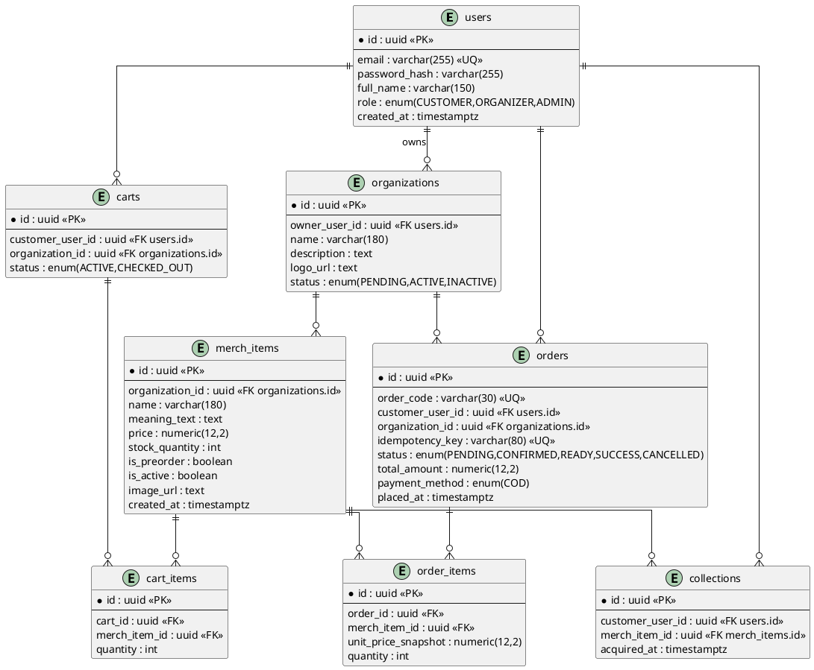

# UITMerch - Software Requirements Specification (SRS)

## Revision and Sign Off Sheet

### Change Record

| Author | Version | Change reference | Date |
| :--- | :---: | :--- | :---: |
| Backend Architect | 1.0 | Initial implementable SRS draft for Cross-University Merch Platform | 30/04/2026 |

**Pre-computation**

1. **Problem Understanding**

Build a multi-role online merchandise platform allowing university clubs/organizations to sell ready-stock and pre-order items. Support cross-university guest access and streamline the collection process.

2. **Stakeholder Perspective**

Customers need easy discovery and reliable COD checkout without strict ID barriers. Organizers need catalog, pre-order, and order status management. Admins need governance.

3. **System Boundary Definition**

In-scope: Auth (JWT), organization profiles, merch catalog (including meaning/story), single-org cart, COD order lifecycle, digital "Collections".
Out-of-scope in `v1`: Online payment gateways (MoMo/VNPay), complex shipping logic (campus pickup only), marketplace settlement.

4. **Constraints and Assumptions**

Backend is Linux + Docker friendly. Object storage (Supabase S3) is used for all media.

5. **High-Level Architecture Direction**

Modular monolith backend using Spring Boot (`auth`, `catalog`, `orders`, `organizations`, `collections`). PostgreSQL as the system of record.

---

## 1. Introduction

### 1.1. Purpose
This document specifies implementable software requirements for UITMerch. It serves as the baseline for architecture, database design, and API implementation.

### 1.2. Scope
The platform supports:
- Flexible registration for UIT students and external guests (no mandatory Student ID).
- Merchandise cataloging with "Pre-order" and "Ready-stock" states.
- Idempotent COD checkout flow.
- A "Collection" system for users to track their purchased university memorabilia.

---

## 2. Functional Requirements

### 2.1. Requirement Baseline

#### Functional Requirements (FR)

| FR ID | Name | Main actor(s) | Description |
| :--- | :--- | :--- | :--- |
| FR01 | Flexible Registration | Customer, Organizer | Register with email, password, full name. No strict domain validation. |
| FR02 | Session Management | All roles | Login to receive JWT `accessToken` and `refreshToken`. |
| FR03 | Merch Discovery | Customer | Search catalog by keyword, organization, or meaning. Supports pagination and sorting. |
| FR04 | Org Management | Organizer | Update organization profile, bio, and logo. |
| FR05 | Catalog Operations | Organizer | CRUD merch items. Toggle `is_preorder` and set `stock_quantity`. |
| FR06 | Cart Management | Customer | Add/remove items. Enforces single-organization constraints per cart. |
| FR07 | COD Checkout | Customer | Submit cart to create a `PENDING` order using `CASH_ON_DELIVERY`. |
| FR08 | Order Processing | Organizer | Update order status (`PENDING` -> `CONFIRMED` -> `READY` -> `SUCCESS`). |
| FR09 | Digital Collection | Customer | View a historical gallery of successfully purchased items. |
| FR10 | Platform Governance | Admin | Approve/Reject organization accounts and oversee transactions. |

#### Business Rules (BR)

| BR ID | Rule |
| :--- | :--- |
| BR01 | `email` is globally unique and valid format. |
| BR02 | Password >= 8 chars, containing uppercase, lowercase, and number. |
| BR03 | An active cart must contain items from **one organization only** to simplify COD pickup logic. |
| BR04 | `POST /api/v1/customer/orders` must support idempotency using an `Idempotency-Key` header. |
| BR05 | MVP payment method is exclusively `COD`. |
| BR06 | Order status flow: `PENDING -> CONFIRMED -> READY_FOR_PICKUP -> SUCCESS` or terminal `CANCELLED`. |
| BR07 | Items marked as `is_preorder=true` bypass standard `stock_quantity > 0` validation during checkout. |
| BR08 | Hard-delete policy: Merch items/Organizations cannot be hard-deleted if linked to any existing orders. |
| BR09 | Only orders with `SUCCESS` status are added to the Customer's "Collection" view. |
| BR10 | All primary keys exposed via APIs must be UUIDs to prevent enumeration. |

---

### 2.2. Use Case Description

#### UC1: Checkout payment and settlement (COD)

| | |
| :--- | :--- |
| **Name** | Checkout payment and settlement |
| **Actor** | Customer |
| **Pre-condition** | Active cart exists with items from a single org. |
| **Post-condition** | Order created with COD payment state. |

**Activities Flow:**
1. Customer submits checkout request with `Idempotency-Key`.
2. Backend validates `Idempotency-Key`. If duplicate, return previous response.
3. Validate cart items (stock check for ready-stock, bypass for pre-orders).
4. Persist `orders` and `order_items`. Deduct stock.
5. Set `status = PENDING` and `payment_method = COD`.
6. Return `201 Created` with Order Code.

---

## 3. Data Model and DB Diagram

### Logical Entities

| Entity | Description | Primary key |
| :--- | :--- | :--- |
| `users` | Accounts for all roles (Guest, Org, Admin) | id (uuid) |
| `organizations` | Club/Faculty profiles | id (uuid) |
| `merch_items` | Sellable merchandise | id (uuid) |
| `carts` | Active shopping carts | id (uuid) |
| `cart_items` | Cart line items | id (uuid) |
| `orders` | Order header (Status, COD logic) | id (uuid) |
| `order_items` | Order lines snapshot | id (uuid) |
| `collections` | Historical record of successful purchases | id (uuid) |

### PlantUML ERD

## 4. API Contracts (Implementable Baseline)

Global Contract Policy: Standard envelope response `{ data, meta, traceId }` for GET, `{ data, traceId }` for POST/PATCH/DELETE.

| API ID | Endpoint | Method | Actor | Success |
| :--- | :--- | :---: | :--- | :--- |
| API-AUTH-01 | `/api/v1/auth/register` | POST | Public | `201 Created` |
| API-AUTH-02 | `/api/v1/auth/login` | POST | Public | `200 OK` |
| API-CAT-01 | `/api/v1/public/merch` | GET | Public | `200 OK` |
| API-ORG-01 | `/api/v1/organizer/merch` | POST | Organizer | `201 Created` |
| API-ORG-02 | `/api/v1/organizer/orders/{id}/status` | PATCH | Organizer | `200 OK` |
| API-CART-01 | `/api/v1/customer/carts/items` | POST | Customer | `200 OK` |
| API-ORD-01 | `/api/v1/customer/orders` | POST | Customer | `201 Created` |
| API-COL-01 | `/api/v1/customer/collections` | GET | Customer | `200 OK` |

---

## 5. Non-functional Requirements

### 5.1. Security & Constraints
- **NFR01:** JWT access tokens utilized for session management.
- **NFR02:** Strict role checks (e.g., `hasRole('ORGANIZER')`) at the Controller/Route level.
- **NFR03:** Supabase Storage used for images; Base64/BLOB persistence in DB is strictly prohibited.
- **NFR04:** Passwords hashed via BCrypt/Argon2.

### 5.2. Architecture & Performance
- **NFR05:** `p95` response time <= 800 ms for merch catalog listing with pagination.
- **NFR06:** Transactions utilizing `@Transactional` bounds for stock deductions and order creations to prevent race conditions.
- **NFR07:** API contracts follow RESTful conventions and are documented via OpenAPI/Swagger 3.1.
- **NFR08:** Database schema is strictly version-controlled using Flyway migrations.