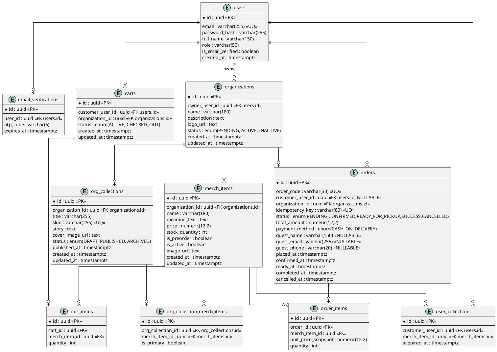

# UITMerch — Software Requirements Specification (SRS)

## Revision and Sign Off Sheet

### Change Record

| Author | Version | Change reference | Date |
| :--- | :---: | :--- | :---: |
| Backend Architect | 1.0 | Initial implementable SRS draft | 30/04/2026 |
| Backend Architect | 1.1 | Corrections: redefine Collections as editorial content; add Guest Checkout; fix org status naming; clarify cart constraint; add missing organizer/admin endpoints; align with Flyway V1–V11 schema | 09/05/2026 |

### What changed from v1.0 → v1.1

| # | Section | Change |
| :--- | :--- | :--- |
| 1 | FR09, BR09, entity `collections` | **Redefined.** Collections = editorial content by Organizer (stories about merch), not purchase history. Purchase history renamed to `user_collections`. |
| 2 | FR-NEW: FR11 | **Added.** Guest Checkout — customer can place COD order without registering. |
| 3 | Organization status | **Fixed.** Aligned with DB enum: `PENDING / ACTIVE / INACTIVE` throughout. `ACTIVE` = approved by Admin. |
| 4 | BR03 — Cart constraint | **Clarified.** One active cart *per organization* (not one cart total). A customer may hold carts from multiple orgs simultaneously. |
| 5 | API table | **Expanded.** Added missing organizer CRUD, admin governance, guest order, and Collections endpoints. |
| 6 | ERD | **Updated.** New entities: `org_collections`, `org_collection_merch_items`. Guest columns on `orders`. `collections` renamed to `user_collections`. |
| 7 | SecurityConfig note | **Added.** RBAC is method-level only (`@PreAuthorize`) — SecurityConfig only enforces authentication boundary. |
| 8 | Migrations | **Added.** V12 (guest checkout), V13 (org_collections) listed as required next migrations. |

---

## 1. Introduction

### 1.1 Purpose

This document specifies implementable software requirements for UITMerch — a multi-role e-commerce platform enabling university clubs and faculties to sell ready-stock and pre-order merchandise, tell stories about their products, and manage COD order fulfillment. It serves as the baseline for architecture, database design, and API implementation.

### 1.2 Scope

The platform supports:

- Flexible registration for customers and organizers (no mandatory Student ID).
- **Guest Checkout** — placing COD orders without creating an account.
- Merchandise cataloging with `is_preorder` and `ready-stock` states.
- **Collections** — editorial content created by Organizers to tell the story and meaning behind their merchandise (distinct from purchase history).
- Idempotent COD checkout flow with single-organization cart constraint per org.
- Order lifecycle management from `PENDING` to `SUCCESS`.
- **User Collections** — purchase history gallery for registered customers (SUCCESS orders only).
- Admin governance: organization approval, user role management.

**Out of scope (v1):** Online payment (MoMo/VNPay), complex shipping, marketplace settlement, plan/tier limits on Collections.

### 1.3 Architecture

Modular monolith — Spring Boot 3.3.5 (Java 21), PostgreSQL + Flyway, Supabase S3 for media, JWT (Spring Security). RBAC enforced at method level via `@PreAuthorize`; SecurityConfig enforces authentication boundary only.

---

## 2. Functional Requirements

### 2.1 Requirement Baseline

#### Functional Requirements (FR)

| FR ID | Name | Actor(s) | Description |
| :--- | :--- | :--- | :--- |
| FR01 | Flexible Registration | Customer, Organizer | Register with email, password, full name. No domain restriction. Two separate endpoints: `/auth/register` (CUSTOMER) and `/auth/register/organizer` (ORGANIZER). |
| FR02 | Email Verification | Customer, Organizer | OTP sent on registration. Account usable only after verification (`is_email_verified = true`). |
| FR03 | Session Management | All registered roles | Login returns JWT `accessToken` and `refreshToken`. Role embedded in JWT claim. |
| FR04 | Merch Discovery | Public (all) | Search catalog by keyword, organization, preorder status. Supports pagination and sorting. No authentication required. |
| FR05 | Organization Management | Organizer | **Create** organization profile (triggers PENDING status). Update name, bio, logo. View own profile. |
| FR06 | Catalog Operations | Organizer | CRUD merch items. Toggle `is_preorder`. Set `stock_quantity`. Org must be `ACTIVE` to create/publish merch. |
| FR07 | Cart Management | Customer (registered) | Add/remove items. One active cart per organization per customer. Customer may hold carts from different orgs simultaneously. |
| FR08 | COD Checkout (registered) | Customer (registered) | Submit active cart to create PENDING order. Idempotency-Key required. |
| FR09 | COD Checkout (guest) | Guest (unauthenticated) | Submit cart items + guest info (name, email, phone) to create PENDING order. No account required. |
| FR10 | Order Processing | Organizer | Update order status through lifecycle. View all incoming orders for own organization. |
| FR11 | Editorial Collections | Organizer | Create, draft, publish, and archive Collections — rich editorial content (title, story, cover image) linking to merch items. Public reads; Organizer writes. |
| FR12 | User Collections (gallery) | Customer (registered) | View personal gallery of successfully purchased merch items. Populated automatically on SUCCESS orders. |
| FR13 | Platform Governance | Admin | Approve (`ACTIVE`) or deactivate (`INACTIVE`) organizations. Manage user roles. View platform-wide orders and users. |

#### Business Rules (BR)

| BR ID | Rule |
| :--- | :--- |
| BR01 | `email` is globally unique and valid format. |
| BR02 | Password ≥ 8 characters, containing uppercase, lowercase, and number. |
| BR03 | One active cart per (customer, organization) pair. A customer may have active carts from multiple organizations simultaneously. |
| BR04 | `POST /api/v1/customer/orders` and `POST /api/v1/guest/orders` must support idempotency via `Idempotency-Key` header. |
| BR05 | MVP payment method is exclusively `CASH_ON_DELIVERY`. |
| BR06 | Order status flow: `PENDING → CONFIRMED → READY_FOR_PICKUP → SUCCESS` or terminal `CANCELLED`. |
| BR07 | Merch items marked `is_preorder = true` bypass `stock_quantity > 0` validation during checkout. |
| BR08 | Hard-delete policy: merch items and organizations cannot be hard-deleted if linked to any existing orders. Use `is_active = false` for soft-delete. |
| BR09 | Only orders with `SUCCESS` status trigger insertion into `user_collections`. Enforced in application layer. |
| BR10 | All primary keys exposed via API must be UUIDs (prevents enumeration). |
| BR11 | Organizer may only create or publish merch items if their organization has `status = ACTIVE`. |
| BR12 | Guest orders must include `guest_name` (required), `guest_email` (required, for order confirmation), `guest_phone` (optional). `customer_user_id` is null for guest orders. |
| BR13 | Constraint: for every order row, exactly one of `customer_user_id` or `guest_name` must be non-null (`CHECK (customer_user_id IS NOT NULL OR guest_name IS NOT NULL)`). |
| BR14 | Editorial Collections belong to an Organization. One org may have unlimited collections. A merch item may belong to multiple collections (many-to-many). |
| BR15 | Only `PUBLISHED` collections are visible to the public. `DRAFT` and `ARCHIVED` are visible to the owning Organizer only. |

---

### 2.2 Use Case Descriptions

#### UC1: Checkout — Registered Customer (COD)

| | |
| :--- | :--- |
| **Actor** | Customer (registered) |
| **Pre-condition** | Active cart exists. Customer is authenticated (`is_email_verified = true`). |
| **Post-condition** | Order created with status `PENDING`, payment `CASH_ON_DELIVERY`. |

**Flow:**
1. Customer submits `POST /api/v1/customer/orders` with `Idempotency-Key` header.
2. Backend checks idempotency key — if duplicate, return cached `201` response.
3. Validate cart: stock check (bypass for preorder items per BR07).
4. Persist `orders` and `order_items`. Deduct stock for ready-stock items.
5. Set `status = PENDING`, `payment_method = CASH_ON_DELIVERY`, `placed_at = now()`.
6. Return `201 Created` with `order_code`.

---

#### UC2: Checkout — Guest (COD)

| | |
| :--- | :--- |
| **Actor** | Unauthenticated visitor |
| **Pre-condition** | Guest has selected items (cart managed client-side). |
| **Post-condition** | Order created with `customer_user_id = null`, guest fields populated. |

**Flow:**
1. Guest submits `POST /api/v1/guest/orders` with cart items + `{ guest_name, guest_email, guest_phone }` + `Idempotency-Key`.
2. Backend validates idempotency key.
3. Validate items (stock check, preorder bypass).
4. Persist `orders` (with `customer_user_id = null`) and `order_items`. Deduct stock.
5. Return `201 Created` with `order_code`. Send confirmation to `guest_email`.

---

#### UC3: Organizer publishes a Collection

| | |
| :--- | :--- |
| **Actor** | Organizer |
| **Pre-condition** | Organizer is authenticated. Organization is `ACTIVE`. |
| **Post-condition** | Collection visible to public with linked merch items. |

**Flow:**
1. Organizer creates collection: `POST /api/v1/organizer/collections` → `status = DRAFT`.
2. Organizer adds merch items: `POST /api/v1/organizer/collections/{id}/merch`.
3. Organizer publishes: `PATCH /api/v1/organizer/collections/{id}` with `{ status: "PUBLISHED" }`.
4. Collection visible at `GET /api/v1/public/collections/{slug}`.
5. Customer reads story, clicks merch item → add to cart → checkout.

---

## 3. Data Model

### 3.1 Entity Summary

| Entity | Description | Notes |
| :--- | :--- | :--- |
| `users` | All registered accounts | role: VARCHAR(50) — `CUSTOMER`, `ORGANIZER`, `ADMIN` |
| `email_verifications` | OTP records for email verification | Expires after TTL |
| `organizations` | Club/faculty profiles | status: `PENDING`, `ACTIVE`, `INACTIVE` |
| `merch_items` | Sellable merchandise | `meaning_text` = short description inline; full story lives in `org_collections` |
| `carts` | Active shopping carts | Unique per (customer, org, ACTIVE status) |
| `cart_items` | Cart line items | |
| `orders` | Order records | `customer_user_id` nullable for guest orders |
| `order_items` | Snapshot of items at order time | `unit_price_snapshot` preserves price |
| `user_collections` | Purchase history gallery | Populated on SUCCESS order (renamed from `collections`) |
| `org_collections` | **NEW** — Editorial content by Organizer | status: `DRAFT`, `PUBLISHED`, `ARCHIVED` |
| `org_collection_merch_items` | **NEW** — Join table: collection ↔ merch | `is_primary` marks the featured collection for a merch item |

### 3.2 ERD (PlantUML)

### 3.3 Required Migrations

| Migration | Description |
| :--- | :--- |
| `V12__guest_checkout.sql` | Alter `orders`: make `customer_user_id` nullable; add `guest_name VARCHAR(150)`, `guest_email VARCHAR(255)`, `guest_phone VARCHAR(20)`; add constraint BR13. |
| `V13__org_collections.sql` | Create `org_collections` and `org_collection_merch_items` tables. |
| `V14__rename_collections.sql` | Rename table `collections` → `user_collections` for clarity. |

---

## 4. API Contracts

**Global policy:** Response envelope `{ data, meta, traceId }` for GET; `{ data, traceId }` for POST/PATCH/DELETE.

### 4.1 Authentication (Public)

| API ID | Method | Endpoint | Actor | Success |
| :--- | :---: | :--- | :--- | :--- |
| API-AUTH-01 | POST | `/api/v1/auth/register` | Public | `201 Created` |
| API-AUTH-02 | POST | `/api/v1/auth/register/organizer` | Public | `201 Created` |
| API-AUTH-03 | POST | `/api/v1/auth/verify-email` | Public | `200 OK` |
| API-AUTH-04 | POST | `/api/v1/auth/login` | Public | `200 OK` — returns `accessToken`, `refreshToken`, user with role |

### 4.2 Public Catalog (No auth)

| API ID | Method | Endpoint | Actor | Success |
| :--- | :---: | :--- | :--- | :--- |
| API-PUB-01 | GET | `/api/v1/public/merch` | Public | `200 OK` — paginated, filter by org/keyword/preorder |
| API-PUB-02 | GET | `/api/v1/public/collections` | Public | `200 OK` — PUBLISHED collections only |
| API-PUB-03 | GET | `/api/v1/public/collections/{slug}` | Public | `200 OK` — story + linked merch |
| API-PUB-04 | GET | `/api/v1/public/organizations/{id}/collections` | Public | `200 OK` — PUBLISHED collections for one org |

### 4.3 Guest Orders (No auth)

| API ID | Method | Endpoint | Actor | Success |
| :--- | :---: | :--- | :--- | :--- |
| API-GUEST-01 | POST | `/api/v1/guest/orders` | Guest | `201 Created` — order_code returned |
| API-GUEST-02 | GET | `/api/v1/guest/orders/track?code={order_code}` | Guest | `200 OK` — order status lookup by code |

### 4.4 Customer Endpoints (ROLE_CUSTOMER)

| API ID | Method | Endpoint | Success |
| :--- | :---: | :--- | :--- |
| API-CUST-01 | POST | `/api/v1/customer/cart/items` | `200 OK` |
| API-CUST-02 | GET | `/api/v1/customer/cart` | `200 OK` |
| API-CUST-03 | DELETE | `/api/v1/customer/cart/items/{itemId}` | `200 OK` |
| API-CUST-04 | POST | `/api/v1/customer/orders` | `201 Created` |
| API-CUST-05 | GET | `/api/v1/customer/orders` | `200 OK` — order history |
| API-CUST-06 | GET | `/api/v1/customer/collections` | `200 OK` — user_collections gallery (SUCCESS orders) |

### 4.5 Organizer Endpoints (ROLE_ORGANIZER)

| API ID | Method | Endpoint | Success |
| :--- | :---: | :--- | :--- |
| API-ORG-01 | POST | `/api/v1/organizer/organizations` | `201 Created` — creates org, status=PENDING |
| API-ORG-02 | GET | `/api/v1/organizer/organizations/me` | `200 OK` |
| API-ORG-03 | PATCH | `/api/v1/organizer/organizations/{id}` | `200 OK` |
| API-ORG-04 | POST | `/api/v1/organizer/merch` | `201 Created` — org must be ACTIVE (BR11) |
| API-ORG-05 | GET | `/api/v1/organizer/merch` | `200 OK` — all merch for own org |
| API-ORG-06 | PATCH | `/api/v1/organizer/merch/{id}` | `200 OK` |
| API-ORG-07 | DELETE | `/api/v1/organizer/merch/{id}` | `200 OK` — soft delete (`is_active=false`), hard-delete blocked if orders exist (BR08) |
| API-ORG-08 | GET | `/api/v1/organizer/orders` | `200 OK` — incoming orders for own org |
| API-ORG-09 | PATCH | `/api/v1/organizer/orders/{id}/status` | `200 OK` |
| API-ORG-10 | POST | `/api/v1/organizer/collections` | `201 Created` — status=DRAFT |
| API-ORG-11 | GET | `/api/v1/organizer/collections` | `200 OK` — all statuses (DRAFT, PUBLISHED, ARCHIVED) |
| API-ORG-12 | PATCH | `/api/v1/organizer/collections/{id}` | `200 OK` — edit content or change status |
| API-ORG-13 | POST | `/api/v1/organizer/collections/{id}/merch` | `200 OK` — attach merch item |
| API-ORG-14 | DELETE | `/api/v1/organizer/collections/{id}/merch/{merchId}` | `200 OK` — detach merch item |

### 4.6 Admin Endpoints (ROLE_ADMIN)

| API ID | Method | Endpoint | Success |
| :--- | :---: | :--- | :--- |
| API-ADM-01 | GET | `/api/v1/admin/users` | `200 OK` — list/search users, filter by role |
| API-ADM-02 | PATCH | `/api/v1/admin/users/{id}/role` | `200 OK` |
| API-ADM-03 | GET | `/api/v1/admin/organizations` | `200 OK` — filter by status (PENDING for approval queue) |
| API-ADM-04 | PATCH | `/api/v1/admin/organizations/{id}/status` | `200 OK` — set ACTIVE or INACTIVE |
| API-ADM-05 | GET | `/api/v1/admin/orders` | `200 OK` — platform-wide order view |

---

## 5. Role Summary

| Role | Assigned via | Key constraints |
| :--- | :--- | :--- |
| Unauthenticated / Guest | — | Read catalog, read Collections, place guest orders |
| `CUSTOMER` | `POST /auth/register` | Cart, registered checkout, order history, user_collections gallery |
| `ORGANIZER` | `POST /auth/register/organizer` | Must have ACTIVE org to create/publish merch and collections |
| `ADMIN` | Admin seed or `PATCH /admin/users/{id}/role` | Full governance access |

### Role transition rules

| From | To | Trigger |
| :--- | :--- | :--- |
| `CUSTOMER` | `ORGANIZER` | `PATCH /api/v1/admin/users/{id}/role` by Admin |
| `ORGANIZER` | `CUSTOMER` | Same endpoint |
| `PENDING` org | `ACTIVE` org | `PATCH /api/v1/admin/organizations/{id}/status` by Admin |
| `ACTIVE` org | `INACTIVE` org | Same endpoint |

---

## 6. Non-Functional Requirements

| NFR ID | Requirement |
| :--- | :--- |
| NFR01 | JWT access tokens for session management. Role embedded in token claims. |
| NFR02 | RBAC enforced at method level via `@PreAuthorize`. SecurityConfig enforces authentication boundary only (`anyRequest().authenticated()`). |
| NFR03 | Supabase Storage for all media. Base64/BLOB in DB strictly prohibited. |
| NFR04 | Passwords hashed via BCrypt (configured in `SecurityConfig`). |
| NFR05 | `p95` response time ≤ 800ms for paginated merch catalog listing. |
| NFR06 | `@Transactional` bounds on stock deduction and order creation to prevent race conditions. |
| NFR07 | API documented via OpenAPI/Swagger 3.1. Swagger tags ordered by flow: Auth → Public → Guest → Customer → Organizer → Admin. |
| NFR08 | Schema version-controlled via Flyway. No manual DB changes outside migrations. |
| NFR09 | Public endpoints (`/auth/**`, `/public/**`, `/guest/**`) explicitly listed as `permitAll()` in SecurityConfig to avoid lock icon confusion in Swagger. |

---

## 7. Open Questions

| # | Question | Impact |
| :--- | :--- | :--- |
| OQ-01 | Khi guest đặt hàng xong, có cho phép "claim" đơn vào tài khoản nếu họ đăng ký sau không? | Ảnh hưởng `user_collections` và order history |
| OQ-02 | Pre-order có deadline không? Hay Organizer tự đóng bằng cách set `is_preorder=false`? | Cần thêm `preorder_deadline` field nếu có |
| OQ-03 | Organizer có thể tự INACTIVE org không, hay chỉ Admin? | Quyết định endpoint PATCH org status có ở Organizer side không |
| OQ-04 | `meaning_text` trong `merch_items` có còn cần thiết sau khi có Collections không? | Có thể giữ làm short tagline, Collections làm full story |
| OQ-05 | Guest order tracking — cần xác thực gì để xem? Chỉ cần `order_code`? Hay thêm email? | Security của `GET /guest/orders/track` |

---

*UITMerch SRS v1.1 — aligned with Flyway V1–V11, SecurityConfig.java, và các trao đổi thiết kế 09/05/2026.*