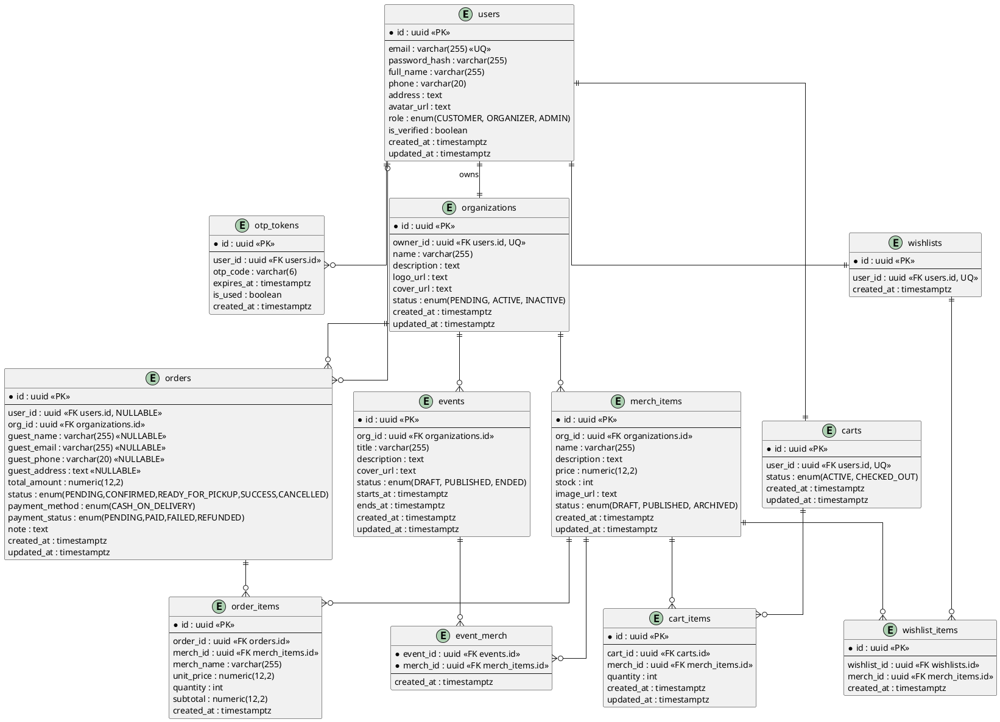

# UITMerch — Software Requirements Specification (SRS)

## Revision and Sign Off Sheet

### Change Record

| Author | Version | Change Reference | Date |
| :--- | :---: | :--- | :---: |
| Backend Architect | 1.0 | Initial implementable SRS draft | 30/04/2026 |
| Backend Architect | 1.1 | Corrections: redefine Collections as editorial content; add Guest Checkout; fix org status naming; clarify cart constraint; add missing organizer/admin endpoints | 09/05/2026 |
| Backend Architect | 2.0 | Scope reduction: remove Collections (org + user), remove Variants; add Events + Wishlist; simplify cart (1 per user); align with Flyway V1–V9 schema; finalize Guest Checkout via public endpoint | 09/05/2026 |

### What Changed from v1.1 → v2.0

| # | Section | Change |
| :--- | :--- | :--- |
| 1 | Collections (org + user) | **Removed.** Editorial Collections and User Collections gallery dropped from MVP scope. |
| 2 | Merch Variants | **Removed.** No size/color variants in MVP. |
| 3 | Events | **Added.** Organizer can create events and attach merch to them. Public can view events. |
| 4 | Wishlist | **Added.** Authenticated customers can save favorite merch items. |
| 5 | Cart constraint | **Simplified.** One active cart per user (dropped per-org constraint). |
| 6 | Guest Checkout endpoint | **Changed.** `POST /api/v1/public/orders` replaces `/guest/orders`. |
| 7 | Guest fields | **Clarified.** `guest_address` is required; `guest_email` is optional. |
| 8 | Migration list | **Reduced.** V1–V9 only. V12–V14 dropped. |
| 9 | Package structure | **Updated.** Reflects 8 domain packages. |

---

## 1. Introduction

### 1.1 Purpose

This document specifies implementable software requirements for UITMerch — a multi-role e-commerce platform enabling UIT university clubs and faculties to sell merchandise, promote events, and manage COD order fulfillment. It serves as the baseline for database design, API contracts, and backend implementation.

### 1.2 Scope

The platform supports:

- Flexible registration for Customers and Organizers (no Student ID required).
- **Guest Checkout** — placing COD orders without creating an account.
- Merchandise catalog management with `DRAFT / PUBLISHED / ARCHIVED` lifecycle.
- **Events** — Organizers create events and attach merch items; public can browse events.
- **Wishlist** — Authenticated customers can save and manage favorite merch items.
- Simple cart: one active cart per user, checkout creates an order.
- Order lifecycle management from `PENDING` to `SUCCESS`.
- Admin governance: organization approval, user role management.

**Out of scope (v1):** Online payment (MoMo/VNPay), Merch Variants (size/color), Editorial Collections, User Collections gallery, complex shipping, marketplace settlement.

### 1.3 Architecture

Modular monolith — Spring Boot 3.3.x (Java 21), PostgreSQL + Flyway, Supabase Storage for media, JWT (Spring Security). RBAC enforced at method level via `@PreAuthorize`; SecurityConfig enforces authentication boundary only.

### 1.4 Package Structure

```
com.uitmerch.backend/
├── common/
│   ├── config/          (SecurityConfig, JwtConfig, CorsConfig)
│   ├── exception/       (GlobalExceptionHandler, custom exceptions)
│   └── response/        (ApiResponse wrapper)
├── auth/                (register, login, OTP verification)
├── user/                (customer profile)
├── organization/        (org CRUD, public org endpoints)
├── merch/               (merch items + public catalog)
├── cart/                (cart + cart items)
├── order/               (checkout, order lifecycle)
├── wishlist/            (customer wishlist)
└── event/               (org events + event-merch linking)
```

---

## 2. Functional Requirements

### 2.1 Requirement Baseline

#### Functional Requirements (FR)

| FR ID | Name | Actor(s) | Description |
| :--- | :--- | :--- | :--- |
| FR01 | Flexible Registration | Customer, Organizer | Register with email, password, and full name. No domain restriction. Two separate endpoints: `/auth/register` (CUSTOMER) and `/auth/register/organizer` (ORGANIZER). |
| FR02 | Email Verification | Customer, Organizer | OTP sent via email upon registration. Account is only usable after verification (`is_verified = true`). |
| FR03 | Session Management | All registered roles | Login returns JWT `accessToken` and `refreshToken`. Role is embedded in the JWT claim. |
| FR04 | Merch Discovery | Public (all) | Browse and search the catalog by keyword or organization. Supports pagination and sorting. No authentication required. |
| FR05 | Organization Management | Organizer | Create an organization profile (triggers `PENDING` status). Update name, description, logo, and cover image. View own organization profile. |
| FR06 | Catalog Operations | Organizer | Full CRUD on merch items. Set stock quantity. Organization must be `ACTIVE` to create or publish merch. |
| FR07 | Cart Management | Customer (authenticated) | Add, remove, and update quantity of items. One active cart per user. Supports "Buy Now" (instant checkout). |
| FR08 | COD Checkout (Registered) | Customer (authenticated) | Submit the active cart to create a `PENDING` order. Delivery and contact info taken automatically from the user's profile. |
| FR09 | COD Checkout (Guest) | Guest (unauthenticated) | Submit items along with guest info (name, phone, address) to create a `PENDING` order. No account required. |
| FR10 | Order Processing | Organizer | Update order status through its lifecycle. View all incoming orders for own organization. |
| FR11 | Events | Organizer, Public | Organizer creates and manages events. Attaches merch items to events. Public can browse published events and their associated merch. |
| FR12 | Wishlist | Customer (authenticated) | Add or remove merch items from a personal wishlist. View all saved items. |
| FR13 | Platform Governance | Admin | Approve (`ACTIVE`) or deactivate (`INACTIVE`) organizations. Manage user roles. View platform-wide orders. |

#### Business Rules (BR)

| BR ID | Rule |
| :--- | :--- |
| BR01 | `email` must be globally unique and in a valid format. |
| BR02 | Password must be ≥ 8 characters and contain at least one uppercase letter, one lowercase letter, and one number. |
| BR03 | Each user has exactly one active cart at any given time. |
| BR04 | MVP payment method is exclusively `CASH_ON_DELIVERY`. |
| BR05 | Order status flow: `PENDING → CONFIRMED → READY_FOR_PICKUP → SUCCESS`, or terminal `CANCELLED`. |
| BR06 | Hard-delete policy: merch items and organizations cannot be hard-deleted if linked to any existing orders. Use `status = ARCHIVED` for soft-deleting merch. |
| BR07 | All primary keys exposed via the API must be UUIDs (prevents enumeration attacks). |
| BR08 | An Organizer may only create or publish merch items if their organization has `status = ACTIVE`. |
| BR09 | Guest orders must include `guest_name`, `guest_phone`, and `guest_address`. `guest_email` is optional. `user_id` is null for all guest orders. |
| BR10 | DB-level constraint: for every row in `orders`, either `user_id IS NOT NULL` or `guest_name IS NOT NULL` must hold — both cannot be null simultaneously. |
| BR11 | `order_items` stores a snapshot of `merch_name` and `unit_price` at the time of order placement. Subsequent price changes on the merch item do not affect existing orders. |
| BR12 | Wishlist is only available to authenticated users. Guests do not have a wishlist. |
| BR13 | An event belongs to one organization. Merch items attached to an event must belong to the same organization. |

---

### 2.2 Use Case Descriptions

#### UC1: Checkout — Registered Customer (COD)

| | |
| :--- | :--- |
| **Actor** | Customer (authenticated) |
| **Pre-condition** | An active cart exists with at least one item. Customer has verified their email. |
| **Post-condition** | Order created with status `PENDING` and payment method `CASH_ON_DELIVERY`. |

**Flow:**
1. Customer calls `POST /api/v1/customer/cart/checkout`.
2. Backend validates the cart: checks stock availability for each item.
3. Persists `orders` and `order_items` (with price and name snapshots).
4. Deducts stock. Sets cart `status = CHECKED_OUT`.
5. Returns `201 Created` with order details.

---

#### UC2: Checkout — Guest (COD)

| | |
| :--- | :--- |
| **Actor** | Unauthenticated visitor |
| **Pre-condition** | Guest has selected items (cart managed client-side). |
| **Post-condition** | Order created with `user_id = null` and guest fields populated. |

**Flow:**
1. Guest calls `POST /api/v1/public/orders` with body: `{ items: [{ merchId, quantity }], guestName, guestPhone, guestAddress, guestEmail? }`.
2. Backend validates items (stock check; merch must be `PUBLISHED`).
3. Persists `orders` (with `user_id = null`) and `order_items`. Deducts stock.
4. Returns `201 Created` with order details.

---

#### UC3: Organizer Creates an Event and Attaches Merch

| | |
| :--- | :--- |
| **Actor** | Organizer |
| **Pre-condition** | Organizer is authenticated. Organization has `status = ACTIVE`. |
| **Post-condition** | Event is publicly visible with its associated merch items. |

**Flow:**
1. Organizer creates an event: `POST /api/v1/organizations/events` → `status = DRAFT`.
2. Organizer attaches merch: `POST /api/v1/organizations/events/{id}/merch`.
3. Organizer publishes: `PATCH /api/v1/organizations/events/{id}` with `{ status: "PUBLISHED" }`.
4. Event is publicly accessible at `GET /api/v1/public/events/{id}`.

---

## 3. Data Model

### 3.1 Entity Summary

| Entity | Description | Notes |
| :--- | :--- | :--- |
| `users` | All registered accounts | role: `CUSTOMER`, `ORGANIZER`, `ADMIN` |
| `otp_tokens` | OTP records for email verification | Expires after TTL |
| `organizations` | Club/faculty profiles | status: `PENDING`, `ACTIVE`, `INACTIVE` |
| `merch_items` | Sellable merchandise | status: `DRAFT`, `PUBLISHED`, `ARCHIVED` |
| `events` | Organization events | status: `DRAFT`, `PUBLISHED`, `ENDED` |
| `event_merch` | Join table: event ↔ merch | Composite PK `(event_id, merch_id)` |
| `carts` | Active shopping carts | One cart per user — `UNIQUE(user_id)` |
| `cart_items` | Line items in a cart | `UNIQUE(cart_id, merch_id)` |
| `orders` | Order records | `user_id` nullable for guest orders |
| `order_items` | Snapshot of items at order time | Stores `merch_name` + `unit_price` |
| `wishlists` | Customer wishlists | One wishlist per user — `UNIQUE(user_id)` |
| `wishlist_items` | Merch items in a wishlist | `UNIQUE(wishlist_id, merch_id)` |

### 3.2 ERD (PlantUML)



### 3.3 Migration Files

| Migration | Description |
| :--- | :--- |
| `V1__init_enums.sql` | All PostgreSQL ENUMs: `user_role`, `organization_status`, `merch_item_status`, `event_status`, `cart_status`, `order_status`, `payment_method`, `payment_status` |
| `V2__create_users.sql` | Tables: `users`, `otp_tokens` |
| `V3__create_organizations.sql` | Table: `organizations` |
| `V4__create_merchs.sql` | Table: `merch_items` |
| `V5__create_events.sql` | Tables: `events`, `event_merch` |
| `V6__create_carts.sql` | Tables: `carts`, `cart_items` |
| `V7__create_orders.sql` | Tables: `orders`, `order_items` (includes guest constraint) |
| `V8__create_wishlists.sql` | Tables: `wishlists`, `wishlist_items` |
| `V9__create_indexes.sql` | Indexes on all foreign keys and frequently queried columns |

---

## 4. API Contracts

**Global response policy:**
- Success: `{ success: true, data: {...}, message: "..." }`
- Paginated: `{ success: true, data: [...], meta: { page, size, total } }`
- Error: `{ success: false, message: "...", code: "ERROR_CODE" }`

### 4.1 Authentication (Public — no auth required)

| API ID | Method | Endpoint | Actor | Success |
| :--- | :---: | :--- | :--- | :--- |
| API-AUTH-01 | POST | `/api/v1/auth/register` | Public | `201 Created` |
| API-AUTH-02 | POST | `/api/v1/auth/register/organizer` | Public | `201 Created` |
| API-AUTH-03 | POST | `/api/v1/auth/verify-email` | Public | `200 OK` |
| API-AUTH-04 | POST | `/api/v1/auth/login` | Public | `200 OK` — returns `accessToken`, `refreshToken`, user info with role |

### 4.2 Public Catalog (No auth required)

| API ID | Method | Endpoint | Description | Success |
| :--- | :---: | :--- | :--- | :--- |
| API-PUB-01 | GET | `/api/v1/public/merch` | List all PUBLISHED merch. Supports keyword filter and pagination. | `200 OK` |
| API-PUB-02 | GET | `/api/v1/public/merch/{id}` | Get details of a single merch item. | `200 OK` |
| API-PUB-03 | GET | `/api/v1/public/merch/popular` | Get popular merch items. | `200 OK` |
| API-PUB-04 | GET | `/api/v1/public/organizations` | List all ACTIVE organizations. | `200 OK` |
| API-PUB-05 | GET | `/api/v1/public/organizations/{id}` | Get details of a single organization. | `200 OK` |
| API-PUB-06 | GET | `/api/v1/public/organizations/{id}/merch` | List all PUBLISHED merch belonging to one organization. | `200 OK` |
| API-PUB-07 | GET | `/api/v1/public/organizations/{id}/events` | List all PUBLISHED events of one organization. | `200 OK` |
| API-PUB-08 | GET | `/api/v1/public/events` | List all PUBLISHED events across the platform. | `200 OK` |
| API-PUB-09 | GET | `/api/v1/public/events/{id}` | Get details of a single event including attached merch. | `200 OK` |
| API-PUB-10 | POST | `/api/v1/public/orders` | Guest checkout — place a COD order without an account. | `201 Created` |

### 4.3 Customer Endpoints (ROLE_CUSTOMER)

| API ID | Method | Endpoint | Description | Success |
| :--- | :---: | :--- | :--- | :--- |
| API-CUST-01 | GET | `/api/v1/customer/profile` | Get own profile information. | `200 OK` |
| API-CUST-02 | PATCH | `/api/v1/customer/profile` | Update own profile information. | `200 OK` |
| API-CUST-03 | GET | `/api/v1/customer/cart` | View the current active cart. | `200 OK` |
| API-CUST-04 | POST | `/api/v1/customer/cart/items` | Add a merch item to the cart. | `200 OK` |
| API-CUST-05 | PATCH | `/api/v1/customer/cart/items/{itemId}` | Update quantity of a cart item. | `200 OK` |
| API-CUST-06 | DELETE | `/api/v1/customer/cart/items/{itemId}` | Remove an item from the cart. | `200 OK` |
| API-CUST-07 | POST | `/api/v1/customer/cart/checkout` | Checkout the active cart and create an order. | `201 Created` |
| API-CUST-08 | POST | `/api/v1/customer/orders/instant` | Buy Now — create an order for a single merch item, bypassing the cart. | `201 Created` |
| API-CUST-09 | GET | `/api/v1/customer/orders` | Get order history. Supports `?status=` filter. | `200 OK` |
| API-CUST-10 | GET | `/api/v1/customer/orders/{id}` | Get details of a single order. | `200 OK` |
| API-CUST-11 | GET | `/api/v1/customer/wishlist` | Get all items in the wishlist. | `200 OK` |
| API-CUST-12 | POST | `/api/v1/customer/wishlist/{merchId}` | Add a merch item to the wishlist. | `200 OK` |
| API-CUST-13 | DELETE | `/api/v1/customer/wishlist/{merchId}` | Remove a merch item from the wishlist. | `200 OK` |

### 4.4 Organization Endpoints (ROLE_ORGANIZER)

| API ID | Method | Endpoint | Description | Success |
| :--- | :---: | :--- | :--- | :--- |
| API-ORG-01 | GET | `/api/v1/organizations/me` | Get own organization profile. | `200 OK` |
| API-ORG-02 | PATCH | `/api/v1/organizations/me` | Update own organization profile (name, description, logo, cover). | `200 OK` |
| API-ORG-03 | POST | `/api/v1/organizations/merchs` | Create a new merch item. Organization must be `ACTIVE` (BR08). | `201 Created` |
| API-ORG-04 | GET | `/api/v1/organizations/merchs` | List all merch items for own org (all statuses). | `200 OK` |
| API-ORG-05 | GET | `/api/v1/organizations/merchs/{id}` | Get details of a single merch item. | `200 OK` |
| API-ORG-06 | PATCH | `/api/v1/organizations/merchs/{id}` | Update merch item info or change status. | `200 OK` |
| API-ORG-07 | DELETE | `/api/v1/organizations/merchs/{id}` | Soft-delete merch item (`status → ARCHIVED`). Hard-delete blocked if orders exist (BR06). | `200 OK` |
| API-ORG-08 | GET | `/api/v1/organizations/orders` | List all incoming orders for own organization. | `200 OK` |
| API-ORG-09 | GET | `/api/v1/organizations/orders/{id}` | Get details of a single incoming order. | `200 OK` |
| API-ORG-10 | PATCH | `/api/v1/organizations/orders/{id}/status` | Update order status through lifecycle (BR05). | `200 OK` |
| API-ORG-11 | POST | `/api/v1/organizations/events` | Create a new event (`status = DRAFT`). | `201 Created` |
| API-ORG-12 | GET | `/api/v1/organizations/events` | List all events for own organization (all statuses). | `200 OK` |
| API-ORG-13 | GET | `/api/v1/organizations/events/{id}` | Get details of a single event. | `200 OK` |
| API-ORG-14 | PATCH | `/api/v1/organizations/events/{id}` | Update event info or change status (`DRAFT → PUBLISHED → ENDED`). | `200 OK` |
| API-ORG-15 | POST | `/api/v1/organizations/events/{id}/merch` | Attach a merch item to an event. | `200 OK` |
| API-ORG-16 | DELETE | `/api/v1/organizations/events/{id}/merch/{merchId}` | Detach a merch item from an event. | `200 OK` |

### 4.5 Admin Endpoints (ROLE_ADMIN)

| API ID | Method | Endpoint | Description | Success |
| :--- | :---: | :--- | :--- | :--- |
| API-ADM-01 | GET | `/api/v1/admin/users` | List and search users. Supports `?role=` filter. | `200 OK` |
| API-ADM-02 | PATCH | `/api/v1/admin/users/{id}/role` | Change the role of a user. | `200 OK` |
| API-ADM-03 | GET | `/api/v1/admin/organizations` | List organizations. Supports `?status=PENDING` for approval queue. | `200 OK` |
| API-ADM-04 | PATCH | `/api/v1/admin/organizations/{id}/status` | Approve (`ACTIVE`) or deactivate (`INACTIVE`) an organization. | `200 OK` |
| API-ADM-05 | GET | `/api/v1/admin/orders` | View all orders across the platform. | `200 OK` |

---

## 5. Role Summary

| Role | Assigned Via | Key Permissions |
| :--- | :--- | :--- |
| Guest (unauthenticated) | — | Browse catalog, view events, place guest COD orders |
| `CUSTOMER` | `POST /auth/register` | Cart, checkout, order history, wishlist |
| `ORGANIZER` | `POST /auth/register/organizer` | Manage org profile, merch, events; view own org's orders |
| `ADMIN` | Admin seed or `PATCH /admin/users/{id}/role` | Full platform governance |

### Role Transition Rules

| From | To | Trigger |
| :--- | :--- | :--- |
| `CUSTOMER` | `ORGANIZER` | `PATCH /api/v1/admin/users/{id}/role` by Admin |
| `ORGANIZER` | `CUSTOMER` | Same endpoint |
| Org `PENDING` | Org `ACTIVE` | `PATCH /api/v1/admin/organizations/{id}/status` by Admin |
| Org `ACTIVE` | Org `INACTIVE` | Same endpoint |

---

## 6. Non-Functional Requirements

| NFR ID | Requirement |
| :--- | :--- |
| NFR01 | JWT access tokens for session management. Role is embedded in token claims. |
| NFR02 | RBAC enforced at method level via `@PreAuthorize`. SecurityConfig enforces the authentication boundary only (`anyRequest().authenticated()`). |
| NFR03 | Supabase Storage for all media assets. Storing Base64 or BLOBs in the database is strictly prohibited. |
| NFR04 | Passwords hashed with BCrypt (configured in `SecurityConfig`). |
| NFR05 | `p95` response time ≤ 800ms for paginated merch catalog listing. |
| NFR06 | `@Transactional` boundaries on stock deduction and order creation to prevent race conditions. |
| NFR07 | API documented via OpenAPI/Swagger 3.1. Swagger tags ordered by flow: Auth → Public → Customer → Organizer → Admin. |
| NFR08 | Schema version-controlled via Flyway. No manual DB changes outside of migration files. |
| NFR09 | Public endpoints (`/auth/**`, `/public/**`) explicitly listed as `permitAll()` in SecurityConfig to avoid authentication lock in Swagger UI. |

---

## 7. Security Config Mapping

```
permitAll():
  POST  /api/v1/auth/**
  GET   /api/v1/public/**
  POST  /api/v1/public/orders        ← guest checkout

hasRole('CUSTOMER'):
  /api/v1/customer/**

hasRole('ORGANIZER'):
  /api/v1/organizations/**

hasRole('ADMIN'):
  /api/v1/admin/**

authenticated() (fallback):
  all remaining endpoints
```

---

## 8. Open Questions

| # | Question | Impact |
| :--- | :--- | :--- |
| OQ-01 | After placing a guest order, should the guest be allowed to "claim" the order into a registered account? | Affects order history and user experience flow |
| OQ-02 | Should events support pre-ordering of merch items, or are they purely promotional? | Requires `is_preorder` flag on `merch_items` if supported |
| OQ-03 | Can an Organizer deactivate their own organization, or is that Admin-only? | Determines whether a PATCH org status endpoint exists on the Organizer side |
| OQ-04 | For guest order tracking, what authentication is required? Order ID only, or order ID + guest phone? | Security design of any future guest tracking endpoint |
| OQ-05 | Does "Buy Now" clear the existing cart, or does it create a parallel order alongside the active cart? | Affects UX and cart state management logic |

---

*UITMerch SRS v2.0 — aligned with Flyway V1–V9, 8-domain package structure, and design decisions made on 09/05/2026.*