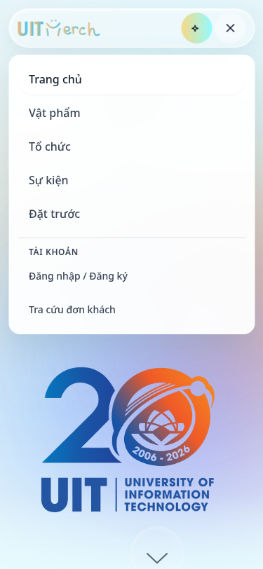

# Navbar follow-up — 02/10/2026

Nhánh: `refactor/fe`, sau commit tích hợp `0aa4e6e`.

Nav trước đó chật vì thêm “Đơn khách” vào hàng chính trong khi giữ width cố định, khoảng cách lớn và scale trên tablet. Bản sửa giữ phong cách glass hiện có, bố trí lại theo nhiệm vụ:

- Hàng chính: Trang chủ, Vật phẩm, Tổ chức, Sự kiện, Đặt trước.
- “Tra cứu đơn khách” nằm trong menu tài khoản, truy cập được cả khi chưa đăng nhập.
- Customer có Giỏ hàng, Đơn hàng của tôi, Đặt trước của tôi, Yêu thích, Tổ chức đang theo dõi và Báo khi có hàng trong menu cá nhân. Organizer/Admin chỉ có các mục quản lý phù hợp vai trò.
- Header co giãn, tối đa 1180px, không scale nội dung. Dưới 1280px dùng menu thu gọn; giữ nút tìm bằng ảnh và thông báo dễ bấm.
- Logo giữ tỷ lệ của SVG. Badge thông báo tối đa `99+` không làm nút rộng thêm; số đầy đủ vẫn có trong title.
- Menu đóng khi chọn link, click bên ngoài, Escape hoặc chuyển breakpoint. Escape trả focus về nút mở. Route chi tiết giữ trạng thái active của mục cha.

## Ảnh đã đối chiếu

Ảnh từ trang chủ local, guest session, API fixtures; không chứa dữ liệu tài khoản thật.

## Kiểm tra

- `npm test --prefix frontend`: **40 tests đạt**.
- `npm run build --prefix frontend`: **TypeScript và Vite production build đạt**. Cảnh báo bundle lớn đã có trước đó vẫn còn.
- `npm run test:e2e --prefix frontend` với Chromium local: **30 tests đạt** trong một lượt cuối; 17 test tính năng hiện có và 13 test nav mới.
- Các test mới kiểm tra viewport 320/375/768/1024/1280/1440px, logo nằm trong header, nút không bị scale/đè, link guest, menu theo ba vai trò, Escape/focus, click outside, navigation closure, parent-route active, đổi breakpoint và 1.000 thông báo chưa đọc.
- Browser tests dùng API fixtures, không gọi checkout/SMTP/Storage production. Chỉ sửa frontend; không chạy lại backend hoặc triển khai cloud cho thay đổi UI này.
- GitNexus impact: `TopNavBar`/`NotificationBell` mức HIGH qua `HomeFixedChrome`, ảnh hưởng `HomePage`/`AppRouter`; đã cảnh báo trước sửa. `HomeFixedChrome` trực tiếp được hai component này gọi. Detect-changes kiểm tra scope trước commit.

Báo cáo tích hợp trước đó: [frontend validation](2026-10-02-frontend-validation.md).
