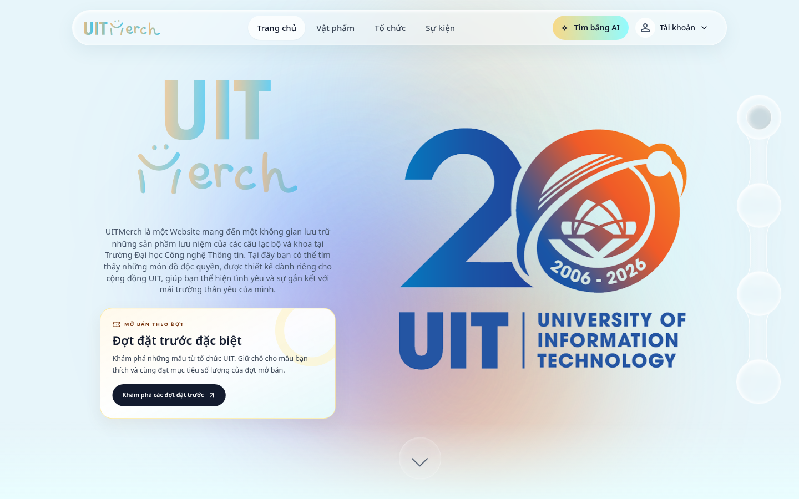

# Bố trí tính năng đặt trước — 02/10/2026

Nhánh: `refactor/fe`, tiếp nối lần sửa navbar `a9f2ed2`.

Đặt trước là một trải nghiệm mở bán theo chiến dịch, nên được giới thiệu bằng khu riêng thay vì đứng ngang hàng với các trang danh mục trên navbar.

- Navbar desktop và menu mobile chỉ còn Trang chủ, Vật phẩm, Tổ chức, Sự kiện.
- Trang chủ có thẻ **Đợt đặt trước đặc biệt** ngay dưới phần giới thiệu: nền kem, điểm nhấn vàng, biểu tượng vé và nút **Khám phá các đợt đặt trước** dẫn tới `/campaigns`.
- Trang vật phẩm có phiên bản banner gọn trước danh sách vật phẩm phổ biến, giúp người đang tìm sản phẩm tiếp cận chiến dịch.
- **Đặt trước của tôi** vẫn nằm trong menu tài khoản customer để xem đơn giữ chỗ cá nhân.
- Nội dung giới thiệu cố định không đưa ra số lượng, hạn chót hoặc khẳng định đang có chiến dịch mở. Trang chiến dịch xử lý dữ liệu thật và trạng thái trống/lỗi.
- Màn hình thấp được cuộn hết nội dung section trước khi wheel chuyển section, tránh bỏ qua nút đặt trước. Section vừa viewport vẫn chuyển bằng snap như trước.

## Ảnh đối chiếu

Trang chủ local với guest session và API fixtures, không dùng dữ liệu tài khoản thật.

## Kiểm tra

- Unit tests: **40/40 đạt**; TypeScript và Vite production build đạt. Cảnh báo bundle lớn hiện có vẫn còn.
- Browser suite cuối: **38/38 đạt**, gồm 17 bài tính năng, 13 bài navbar và 8 bài khám phá đặt trước.
- Test khám phá đặt trước kiểm tra trang chủ ở 1440/375/320px, trang vật phẩm ở 1440/375px, CTA dẫn tới đúng route, không có mục đặt trước trong navbar và menu mobile.
- Test màn hình cao 640px xác nhận cuộn tới CTA trước khi chuyển section; màn hình 1024px vẫn snap sang section vật phẩm.
- Test checkbox Email dùng click rồi chờ trạng thái checked/enabled sau mutation bất đồng bộ; vẫn xác nhận payload chỉ có `emailEnabled`. Bài này đạt 5 lần chạy liên tiếp sau sửa.
- Browser tests dùng API fixtures. Thay đổi này chỉ ở frontend; không xác nhận API production hoặc trạng thái triển khai cloud.

## Phạm vi tác động

GitNexus upstream impact trước sửa: `TopNavBar` mức HIGH qua `HomeFixedChrome`, ảnh hưởng các luồng `HomePage`/`AppRouter`; đã cảnh báo trước sửa. `HomeHero`, `HomePage` và `MerchPage` mức LOW, gọi từ trang chủ/router. `navItems` và callback wheel không có đủ cạnh trong index; đã đối chiếu trực tiếp các vị trí sử dụng trước sửa. Callback bài test không được index, sửa đổi chỉ thuộc kiểm thử.

`PreorderSpotlight` là component mới dùng chung cho trang chủ và catalog, không thay đổi API, schema hoặc logic giữ chỗ.

Detect-changes trên staged diff xác định 8 symbol hiện có và 15 execution flows, mức tổng hợp HIGH do trang chủ dùng chung. Đã đối chiếu các symbol với diff: chỉ thay đổi phần hiển thị và wheel handler. Component/test mới và hai ảnh được kiểm tra trực tiếp vì chưa có symbol tương ứng trong index; không có file backend trong commit.
