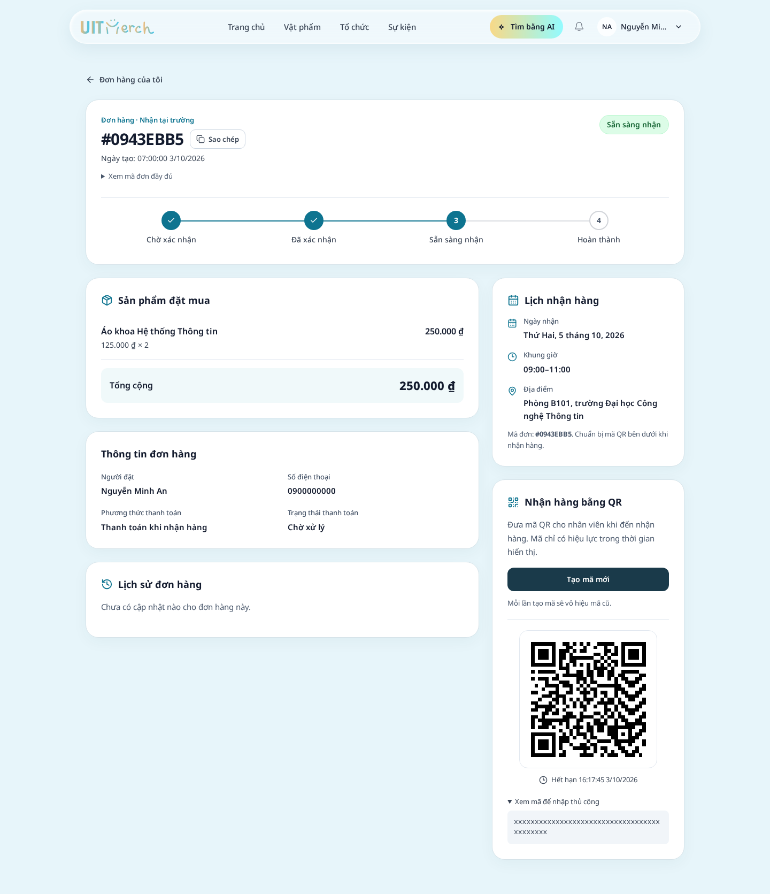
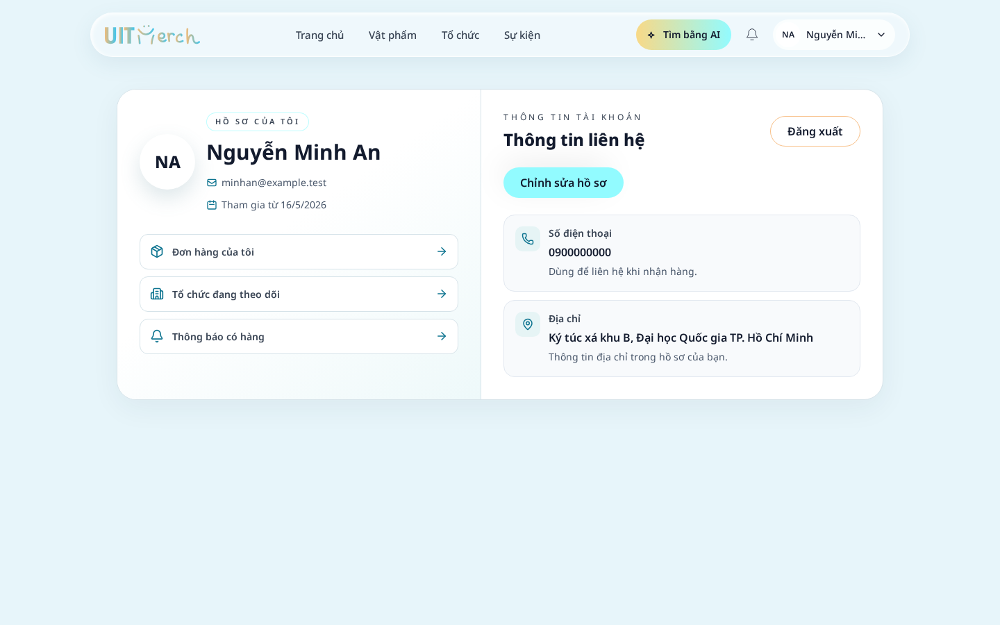
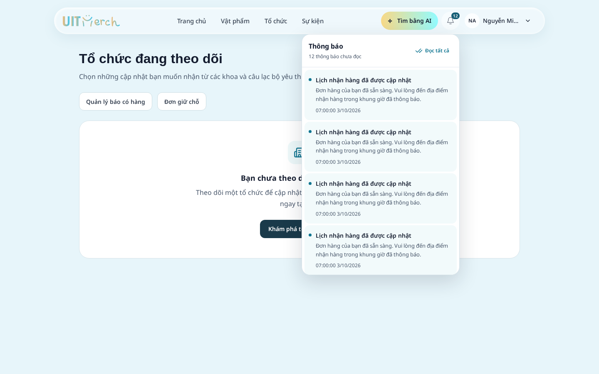

# Cải thiện giao diện khách hàng — 03/10/2026

Các màn hình chi tiết đơn hàng, nhận hàng bằng QR, thông báo, hồ sơ và theo dõi tổ chức trước đây có nền quá trong, chữ phụ khó đọc, khoảng cách thiếu nhất quán và một số khối nằm ngoài chiều rộng của nội dung chính. Bản cập nhật dùng các thẻ nền trắng, viền rõ và bố cục thích ứng với điện thoại.

## Thay đổi

| Khu vực | Kết quả |
| --- | --- |
| Chi tiết đơn hàng | Mã đơn, trạng thái và tiến trình rõ hơn; mã UUID đầy đủ nằm trong mục mở rộng. Desktop chia nội dung và nhận hàng thành hai cột. Mobile đưa lịch nhận và QR lên trước sản phẩm. |
| Nhận hàng | Lịch có nhãn ngày, giờ, địa điểm; QR nằm trong cùng bố cục đơn hàng, có nền trắng, hạn dùng và mục mở mã nhập thủ công. Nút tạo mã mới tách khỏi phần hướng dẫn. |
| Lịch sử | Hiển thị dòng thời gian, nhãn tiếng Việt và trạng thái khi chưa có cập nhật. |
| Thông báo | Phân biệt tiêu đề, nội dung, thời gian và thông báo chưa đọc. Danh sách cuộn trong popup, thanh thao tác cố định; chỉ hiện phân trang khi cần. Popup vừa màn hình điện thoại và đóng bằng Escape. |
| Hồ sơ | Việt hóa nhãn, thao tác và ngày tham gia. Thu gọn khoảng trống; số điện thoại và địa chỉ có biểu tượng, thêm liên kết đến đơn hàng, theo dõi và báo có hàng. |
| Theo dõi / báo có hàng | Tiêu đề có mô tả, danh sách được trình bày bằng thẻ; trạng thái trống có hướng dẫn và liên kết khám phá tổ chức hoặc sản phẩm. |

Nhãn mặc định “Pre-order” trên mọi đơn được đổi thành “Đơn hàng”, vì phản hồi API không cung cấp loại đơn để xác định nhãn này. Phương thức trả tiền khi nhận được hiển thị là “Thanh toán khi nhận hàng”.

## Phạm vi và kiểm tra ảnh hưởng

Thay đổi thuộc frontend; không sửa backend, môi trường hay triển khai lên dịch vụ bên ngoài. Giữ các lời gọi API, xác thực, xử lý hủy đơn, quét QR và vòng đời mã nhận hàng hiện có.

GitNexus đã được cập nhật và chạy phân tích upstream trước khi sửa các symbol. Các component được sửa có mức LOW; `FeatureFrame` có mức MEDIUM với sáu nơi gọi trực tiếp. Kiểm tra thay đổi staged đánh giá tổng phạm vi CRITICAL do nhiều component dùng chung và luồng liên quan. Đã cảnh báo và đối chiếu diff: các symbol và luồng được ghi nhận phù hợp với phạm vi giao diện; không thay đổi logic quét QR, hủy đơn hay các hàm định dạng dùng chung.

Các nơi sử dụng chung cần lưu ý:

- `PickupQR`: phần nhận hàng khách hàng và tra cứu đơn khách.
- `OrderHistoryPanel`: chi tiết đơn, scanner và danh sách đơn của tổ chức.
- `ProfileInfoRow`: hồ sơ khách hàng và hồ sơ người tổ chức.
- `FeatureFrame` và các lớp CSS thẻ dùng chung: trang chiến dịch, giữ chỗ, theo dõi, báo có hàng và tra cứu đơn khách.

## Xác minh

| Kiểm tra | Kết quả |
| --- | --- |
| Unit test frontend | 40/40 pass |
| Toàn bộ Playwright | 55/55 pass, gồm 10 kịch bản giao diện mới |
| Chạy lại 10 kịch bản sau điều chỉnh cuối | 10/10 pass |
| Production build | Pass; còn cảnh báo kích thước chunk trên 500 kB đã có trước đó |
| Responsive | Kiểm tra chiều rộng 1440, 375, 320 px và màn hình ngang 667 × 375 px; không tràn ngang |

Các kịch bản mới kiểm tra tạo QR, mã nhập tay dài, sửa/lưu hồ sơ, cuộn và đóng popup thông báo, cùng các liên kết trong trạng thái trống. Test dùng dữ liệu giả và API mock; không gửi email, tải ảnh, gọi Gemini hay ghi vào backend bên ngoài. Chi tiết máy đọc được: [customer-interface-validation.json](2026-10-03-customer-interface-validation.json).

## Ảnh sau cập nhật

Ảnh dùng tài khoản và đơn hàng giả.

### Chi tiết đơn hàng

[Xem bản điện thoại](assets/2026-10-03-customer-order-375.png).

### Hồ sơ

[Xem bản điện thoại](assets/2026-10-03-customer-profile-375.png).

### Thông báo và theo dõi

[Thông báo trên điện thoại](assets/2026-10-03-customer-notifications-375.png) · [Theo dõi khi chưa có tổ chức](assets/2026-10-03-customer-following-empty.png).
