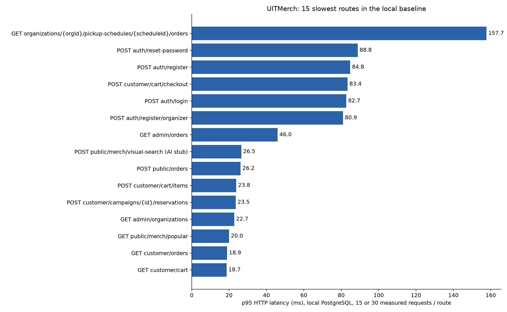
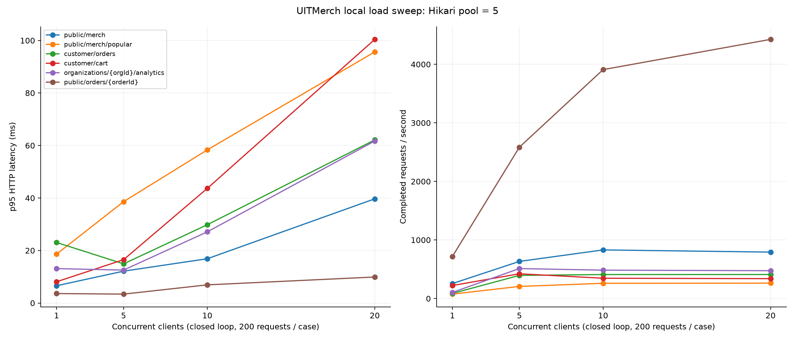
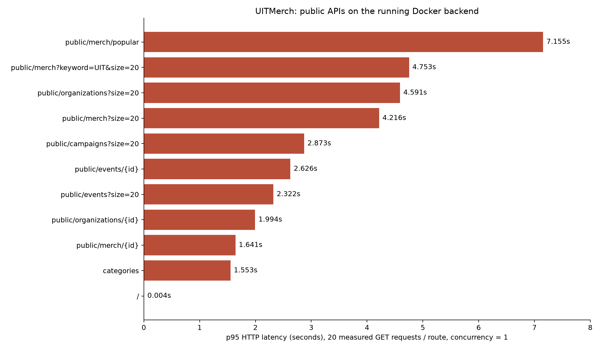

# Báo cáo hiệu năng API UITMerch — 04/10/2026

Đã kiểm kê và đo **103 route của các controller ứng dụng**: 49 GET, 30 POST, 17 PATCH, 7 DELETE. Có **8.130 request được lưu số đo**, gồm 3.060 request baseline, 4.800 request tải đồng thời và 270 request kiểm tra kích thước trang. Cả 103 route có fixture thành công; benchmark cuối không có HTTP 4xx/5xx trong các mẫu được báo cáo. Có thêm 560 request warmup, tổng 8.690 HTTP request trong benchmark local.

Kết luận: ưu tiên giảm số lượt đi database, phân trang danh sách đơn của lịch nhận, bỏ khóa user khỏi đường đọc giỏ hàng sau khi tách việc khởi tạo, và kiểm tra khoảng cách mạng backend–database. Bảng đầy đủ ở cuối báo cáo; số đo không được xem là năng lực production.

## 1. Phạm vi và phương pháp

- Runtime inventory lấy từ `RequestMappingHandlerMapping`, tránh bỏ sót route khi chỉ đọc frontend. Bao gồm health `/` và helper OTP chỉ hoạt động ở profile dev/docker. Không tính framework `/error`, Swagger, CORS OPTIONS/HEAD tự sinh.
- Server Spring Boot 3.3.5, Java 21.0.12.1, PostgreSQL 17; Flyway chạy đủ V1–V43. Máy Intel i9-10885H, 8 core/16 thread, khoảng 31 GiB RAM. HTTP/1.1 keep-alive qua loopback, client/server cùng máy, database trong Docker tmpfs.
- Hikari maximumPoolSize=5, minimumIdle=1 theo profile test docker; không giới hạn CPU/RAM của JVM. Đây không phải cấu hình phần cứng của một máy chủ cloud nhỏ.
- Mỗi route có 5 warmup rồi 30 request tuần tự. API cấp QR customer và visual search dùng 15 mẫu + 5 warmup để không vượt giới hạn 20/phút đang có. Rate limiter chạy thật; IP thử khác nhau cho các giới hạn theo IP.
- Bài tải: 6 API đọc, mỗi API 200 request/case ở concurrency 1, 5, 10, 20. Private API dùng cùng một tài khoản; bài giỏ hàng thể hiện contention trên một user, không đại diện traffic nhiều user. Có đo số connection hoạt động/chờ mỗi 10 ms.
- Đo từ trước gửi HTTP đến khi nhận đầy đủ response. Chuẩn bị user, token, dữ liệu và body nằm ngoài vùng timing. Không phải thời gian riêng của controller/service. SSE chỉ đo đến dòng đầu của event kết nối, không đo 30 phút streaming hay tốc độ fan-out.
- Mail transport, Storage, Vision, Embedding, MerchEmbedding được stub. Ghi outbox, Spring Security, BCrypt, repositories, transactions, serializer và keyword fallback chạy thật. Dispatcher email/campaign scheduler tắt. Không đo thời gian gửi email, Gemini thực, vector search thực, upload cloud, scheduler throughput.
- Logging được hạ WARN trước đo; Hibernate statistics bật. Production INFO logging và scheduler sẽ tạo chi phí khác. p99 của 15/30 mẫu là mẫu lớn nhất; dùng để sàng lọc, không phải ước lượng tail latency production đáng tin cậy. Các bài tải ngắn theo closed loop có thể bỏ sót queueing khi traffic thực đến liên tục.
- Benchmark dùng commit `f070580870b389bd0e4258fe8806862fe561107d` và bản sửa ERROR-dispatch SecurityConfig của lượt trước. Chưa thay đổi thuật toán hoặc migration để tối ưu ứng dụng. Benchmark này xác nhận fixture/HTTP status thành công, không thay cho test chức năng đầy đủ của từng API.

Dữ liệu ban đầu (bao gồm dữ liệu Flyway seed):

| Bảng | Số hàng |
|---|---:|
| `users` | 23 |
| `organizations` | 15 |
| `merch_items` | 1,037 |
| `merch_images` | 1,002 |
| `orders` | 1,011 |
| `order_items` | 1,018 |
| `events` | 111 |
| `notifications` | 2,002 |

Giỏ có 20 sản phẩm; một lịch nhận có khoảng 1.001 đơn. Các route ghi tạo thêm dữ liệu trong run, nên baseline và bài tải không có tập dữ liệu hoàn toàn bất biến. Sau HTTP benchmark, thử SQL riêng tăng dữ liệu lên khoảng 100.000 sản phẩm/đơn; không dùng số liệu này thay cho baseline API.



## 2. Những API chậm nhất trong môi trường cô lập

| API | p50 (ms) | p95 (ms) | Câu lệnh Hibernate/request |
|---|---:|---:|---:|
| `GET /api/v1/organizations/{orgId}/pickup-schedules/{scheduleId}/orders` | 123.93 | 157.68 | 1007.0 |
| `POST /api/v1/auth/reset-password` | 79.51 | 88.82 | 4.0 |
| `POST /api/v1/auth/register` | 77.56 | 84.77 | 6.0 |
| `POST /api/v1/customer/cart/checkout` | 44.51 | 83.38 | 76.0 |
| `POST /api/v1/auth/login` | 76.19 | 82.70 | 3.0 |
| `POST /api/v1/auth/register/organizer` | 77.02 | 80.92 | 6.0 |
| `GET /api/v1/admin/orders` | 27.84 | 45.97 | 25.0 |
| `POST /api/v1/public/merch/visual-search` | 10.55 | 26.52 | 3.0 |
| `POST /api/v1/public/orders` | 7.53 | 26.15 | 8.0 |
| `POST /api/v1/customer/cart/items` | 12.36 | 23.81 | 11.0 |

**Câu lệnh Hibernate không phải tổng SQL**: trong CSV load sweep, SQL-H=0 là placeholder vì bộ đếm bị tắt ở bài tải, không có nghĩa không chạy SQL. bộ đếm không bao gồm `JdbcTemplate`. Ví dụ analytics có thêm 6 truy vấn JDBC trong service; campaign quantity cũng dùng JDBC. Batch insert có thể có nhiều executions trên một prepared statement. SSE authorization theo lịch có thể thêm một ít câu lệnh vào các mẫu khác.

BCrypt khiến login/register/reset password khoảng 80–90 ms ở p95 trên máy này. Đây là công việc bảo vệ mật khẩu có chủ đích; không đề xuất giảm cost BCrypt để đạt KPI tốc độ.

## 3. Tải đồng thời và connection pool



| API | p95 C=1 (ms) | p95 C=20 (ms) | RPS C=1 | RPS C=20 | Thread chờ pool tối đa C=20 |
|---|---:|---:|---:|---:|---:|
| `/api/v1/public/merch` | 6.58 | 39.69 | 255.4 | 792.8 | 15 |
| `/api/v1/public/merch/popular` | 18.63 | 95.65 | 75.5 | 263.0 | 15 |
| `/api/v1/customer/orders` | 23.07 | 62.12 | 87.3 | 410.4 | 15 |
| `/api/v1/customer/cart` | 8.10 | 100.42 | 222.3 | 339.4 | 15 |
| `/api/v1/organizations/{orgId}/analytics` | 13.10 | 61.72 | 104.3 | 475.6 | 15 |
| `/api/v1/public/orders/{orderId}` | 3.61 | 9.91 | 717.6 | 4426.1 | 13 |

Khi concurrency=20, nhiều case có đủ 5 connection đang dùng và 15 thread chờ. Đây là bằng chứng pool có queue trong điều kiện thử. Với giỏ hàng, nhiều request cùng user còn chờ khóa `users` trong `CartService.findOrCreateActiveCart/getActiveCartOrThrow`; tăng pool không giải quyết khóa theo cùng user và có thể kéo dài hàng chờ trong database. Cần thử tiếp nhiều user và các pool 5/10/15 trên hạ tầng staging tương đương trước khi chọn cấu hình. Hikari cũng khuyến cáo đo trước khi tăng pool: [About Pool Sizing](https://github.com/brettwooldridge/HikariCP/wiki/About-Pool-Sizing).

RPS được tính bằng số request hoàn tất/thời gian của case; không phải số user phục vụ được hay cam kết throughput production. Bài local vài trăm request, DB tmpfs, kết nối giữ sẵn có thể đạt RPS rất cao, nhất là tra cứu đơn.

## 4. Số truy vấn tăng theo kích thước trang

| API | size | p95 (ms) | Câu lệnh Hibernate/request |
|---|---:|---:|---:|
| `/api/v1/customer/orders` | 1 | 6.28 | 7.0 |
| `/api/v1/customer/orders` | 20 | 15.65 | 45.0 |
| `/api/v1/customer/orders` | 100 | 26.56 | 140.0 |
| `/api/v1/admin/orders` | 1 | 6.56 | 6.0 |
| `/api/v1/admin/orders` | 20 | 8.80 | 25.0 |
| `/api/v1/admin/orders` | 100 | 23.30 | 105.0 |
| `/api/v1/public/merch` | 1 | 6.12 | 3.0 |
| `/api/v1/public/merch` | 20 | 3.60 | 3.0 |
| `/api/v1/public/merch` | 100 | 6.77 | 3.0 |

Admin orders tăng từ 6 lên 105 câu lệnh khi size tăng từ 1 lên 100. Customer orders tăng từ 7 lên 140, do còn lấy pickup schedule. Public merch giữ 3 câu lệnh nhờ batch loading ảnh. Điều này xác nhận tối ưu ưu tiên là thay truy vấn trong vòng lặp bằng batch loading cho đơn hàng. Khác biệt timing giữa các case có cả JIT/cache/noise, nên số SQL là bằng chứng ổn định hơn các chênh lệch vài ms.

## 5. Thử nghiệm tối ưu SQL trước/sau

Thử nghiệm chỉ thay index/truy vấn trên database disposable. Đây là microbenchmark SQL qua JDBC, chưa phải cải thiện tốc độ API sau một bản sửa được triển khai. Mỗi bên 5 warmup + 30 mẫu. Plan `EXPLAIN (ANALYZE, BUFFERS, FORMAT JSON)` lưu trong JSON cho hai thử index; cách đọc plan theo [PostgreSQL EXPLAIN](https://www.postgresql.org/docs/17/using-explain.html).

| Thử nghiệm | p50 trước → sau (ms) | p95 trước → sau (ms) | Tỷ lệ giảm p95 |
|---|---:|---:|---:|
| Index orders(user_id, created_at DESC, id DESC) | 1.080 → 0.252 | 2.077 → 0.413 | 80.1% |
| 20 truy vấn order_items → một truy vấn IN | 1.276 → 0.127 | 1.804 → 0.187 | 89.7% |
| GIN trigram lower(name), tìm substring | 51.767 → 3.210 | 54.560 → 4.394 | 91.9% |

- Index customer orders bỏ bước Sort sau index scan user_id, giúp lấy 20 hàng đầu nhanh hơn. Dataset thử khoảng 100.000 đơn, phần lớn thuộc user khác.
- Batch order_items giữ dữ liệu tương đương cho 20 order IDs nhưng giảm 20 lần đi DB thành 1. Đây là thử nghiệm hỗ trợ quyết định batch loading, không phải thay toàn bộ OrderService.
- Trigram chuyển Seq Scan thành Bitmap Index Scan + Bitmap Heap Scan trên khoảng 100.000 sản phẩm. Dùng từ khóa chọn lọc `%product 999%`; từ khóa rất phổ biến/ngắn có kết quả khác. `pg_trgm` hỗ trợ LIKE/ILIKE chứa wildcard đầu chuỗi theo [tài liệu PostgreSQL](https://www.postgresql.org/docs/17/pgtrgm.html).
- Trigram thử có partial predicate `status='PUBLISHED'` và SQL literal. API Hibernate dùng bind parameters và thêm điều kiện org ACTIVE; cần kiểm tra plan prepared/generic của truy vấn thực trước rollout, có thể chọn index không partial nếu planner không dùng được. Các index có chi phí ghi, RAM và dung lượng.

## 6. Phân tích và giải pháp theo ưu tiên

### P0 — Giảm round trip và giới hạn danh sách lịch nhận

`OrderService.getCustomerOrders`, `getOrgOrders`, `getAllOrders` và `getPickupScheduleOrders` gọi `findByOrderId` trong vòng lặp. Customer/organizer còn gọi `loadPickupSchedule` từng đơn. Route schedule orders hiện trả toàn bộ `List`, không dùng Pageable; một lịch 1.001 đơn đã tạo 1.007 câu lệnh Hibernate.

Giải pháp: lấy IDs từ một trang order, gọi `findByOrderIdIn(ids)`, group theo orderId; lấy tất cả schedule IDs khác nhau trong một truy vấn và map trong bộ nhớ. Phân trang route schedule orders, mặc định 20 và cap 100/200, hoặc tách summary list khỏi detail. Thay contract phân trang phải cập nhật frontend/API types. Giữ kiểm tra owner/org và dữ liệu snapshot order items. Mục tiêu SQL của các trang đơn là số lượng nhỏ ổn định thay vì tăng theo số đơn; cần regression ownership, cancel và pickup cùng kiểm tra số query sau sửa.

### P0 — Kiểm tra backend–database trên hạ tầng thực

Probe backend đang chạy được trình bày ở mục 7. Health rất nhanh trong khi API phải đi DB chậm nhiều giây; log server xác nhận phần xử lý chậm. Điều này gợi ý kiểm tra thời gian acquire connection, DB network RTT, thời gian từng SQL, cold connection/TLS và tải database. Chưa có tracing từng query nên chưa khẳng định một nguyên nhân duy nhất.

Đặt backend và database cùng vùng cloud khi triển khai; xác định endpoint pooler/direct và kiểu pooling phù hợp với JDBC, giữ tái sử dụng connection. Sau khi đo pool wait, thử cấu hình pool có giới hạn theo quota DB, số instance và worker. Không dùng số core máy local để chọn số connection cho DB cloud.

### P1 — Giỏ hàng: tách đọc khỏi khóa user

`CartService.getCart` gọi `findOrCreateActiveCart`, khóa user ngay cả khi giỏ đã có. Tách đường read-only đọc active cart trước; chỉ khởi tạo khi cần, với unique constraint và xử lý conflict để đảm bảo một active cart. Giữ khóa/transaction ở checkout và các đường ghi cần tính nhất quán. Kiểm tra tạo giỏ song song, add/update/checkout race và stock. Sweep hiện đo cùng user; cần benchmark thêm nhiều user để xác nhận mức cải thiện.

### P1 — Cache dữ liệu public ít đổi và giảm tính lại popularity

`CategoryService.listAll` dùng `findAllByOrderByDisplayOrderAsc`, không dùng method `findAll` có @Cacheable. Cache tại service listAll hoặc method ordered, cùng invalidation khi thay category. Categories nhỏ và ít đổi phù hợp cache; có thể thêm ETag/Cache-Control cho anonymous catalog.

`MerchService.getPopularMerch` mỗi request đọc tối đa 500 candidates, tính hai aggregate orders, tải ảnh của cả candidates rồi mới lấy top 10. Các @CacheEvict hiện có không tạo read cache vì method này chưa @Cacheable. Chỉ tải ảnh top 10; tính/cache danh sách ranking IDs trong job theo lịch hoặc khi dữ liệu thay đổi, rồi lấy price/stock/status mới khi response. Tránh cache nguyên DTO stock lâu vì các kiểm tra hiện tại yêu cầu stock/archival cập nhật ngay.

Frontend apiClient hiện gắn Authorization vào cả request public khi đã đăng nhập. Với endpoint catalog public không phụ thuộc user, có thể dùng transport anonymous để tránh thêm 3 truy vấn auth. Đây là đề xuất chưa đo riêng và cần giữ Authorization cho các API cần danh tính, đặc biệt checkout gắn tài khoản.

### P1 — Index phù hợp filter + sort

Ưu tiên index orders(user_id,created_at DESC,id DESC) từ thử nghiệm đã có. Rà soát filter status thực tế trước khi thêm biến thể user/status/created_at; org/created_at đã tồn tại ở V42 nên không tạo lại. Notification list thường lọc user + sort createdAt: kiểm tra composite index(user_id,created_at DESC,id DESC), unread đã có partial index. Trigram lower(name) cho substring tìm sản phẩm sau khi kiểm tra bind plans. Dùng EXPLAIN trên dữ liệu staging có phân bố thật, tránh thêm hàng loạt index.

### P2 — Xác thực, AI, background delivery và quan sát

- `JwtAuthenticationFilter` kiểm tra blacklist, user và session qua DB; private API có khoảng 3 câu lệnh Hibernate trước công việc riêng. Có thể gộp kiểm tra bằng một query/projection sau khi profile. Parse/verify JWT một lần rồi dùng verified claims. Giữ revocation, authVersion, account active/verified, session expiry và role hiện tại; không bỏ kiểm tra hoặc cache auth mà làm logout/đổi quyền mất hiệu lực.
- Login/register/reset dùng BCrypt: giữ bảo mật và tối ưu phần DB/outbox xung quanh. Đo riêng CPU khi nhiều login thật trên máy cloud nhỏ.
- Visual search đã có semaphore=2, rate limit IP/global và deadline 20 giây cho mỗi provider call. Benchmark AI chỉ đo stub + fallback nên không dùng p95 này cho Gemini production. Vision và embedding gọi nối tiếp có thể dùng hai budget gần 20 giây trong khi frontend apiClient timeout 20 giây. Cần budget tổng, timeout/cancellation đồng bộ, metric từng provider, cache theo hash ảnh/text khi phù hợp; không tăng timeout frontend để che lỗi. Giữ throttle và trả Retry-After rõ.
- Email/embedding/publication đã có durable background jobs: không đề xuất chuyển async lần nữa. Scheduler hiện gọi một dispatchNext rồi fixedDelay 1 giây; thời gian email/OTP đến người dùng phụ thuộc queue backlog và provider latency. Đo queue age, throughput worker, retry; cân nhắc drain nhiều job trong một lần poll hoặc workers có concurrency giới hạn, giữ SKIP LOCKED/idempotency và không giữ transaction trong provider I/O.
- Bổ sung Actuator/Micrometer `http.server.requests`, `jdbc.connections`, `hikaricp` và histogram p95/p99, pool pending/acquire time, SQL/JFR sampling, queue age, error/429 theo route; bảo vệ endpoint quản trị. [Spring Boot Metrics](https://docs.spring.io/spring-boot/reference/actuator/metrics.html) mô tả các metric này.
- Sampling request logging; production INFO logging chưa nằm trong baseline WARN. Giữ traceId, tránh SQL debug/bind value trong tải cao. Đo serialization/response bytes trước khi bật compression cho response lớn.

### Tiêu chí kiểm chứng sau tối ưu

Đề xuất ban đầu cho staging tương đương production: read p95 <300 ms, write p95 <500 ms, auth p95 <1 s, zero 5xx ở tải mục tiêu; thống nhất mức traffic thực trước khi coi đây là SLO. Không áp mục tiêu này cho SSE full lifetime hoặc Gemini stub.

Chạy 5–10 phút mỗi mức tải, traffic có phân bố, nhiều user, cùng SKU và nhiều SKU, cache hit/miss, pagination/filter, lock contention, queue backlog; dùng arrival-rate workload để quan sát queueing. Đo trước/sau trên cùng dữ liệu, phần cứng và cấu hình, báo cả số query và correctness. Thực hiện GitNexus impact trước mọi sửa symbol; migration, business logic và test hồi quy cần review riêng.

## 7. Đối chiếu backend đang chạy

Probe chỉ đọc **11 route public, 220 mẫu + 33 warmup + 3 request khám phá ID**, concurrency=1, HTTP/1.1 keep-alive, không Authorization. Địa chỉ `http://127.0.0.1:8080`: Docker backend đang chạy với database và cấu hình hiện có; thời gian không bao gồm internet từ trình duyệt tới host. Cả 220 mẫu HTTP 200. Không đo API ghi/private trên database hiện có.

Image backend: `sha256:f1aff15f313c79f94473e66d9221d55b73f20a13e154aebec60a89ad9fc090cb`, container tạo 14:21 ngày 04/10/2026 (UTC+7). Không biết chắc commit của image; không coi probe là cùng binary/dataset/config với benchmark local.

| GET API | p50 (ms) | p95 (ms) | p99 (ms) | HTTP |
|---|---:|---:|---:|---|
| `/` | 1.7 | 4.0 | 4.2 | 200 × 20 |
| `/api/v1/categories` | 424.8 | 1552.6 | 1603.5 | 200 × 20 |
| `/api/v1/public/merch?size=20` | 1908.6 | 4216.5 | 4656.4 | 200 × 20 |
| `/api/v1/public/merch?keyword=UIT&size=20` | 3136.0 | 4752.5 | 4779.0 | 200 × 20 |
| `/api/v1/public/merch/popular` | 5554.8 | 7155.1 | 7900.0 | 200 × 20 |
| `/api/v1/public/organizations?size=20` | 2915.0 | 4590.6 | 5887.9 | 200 × 20 |
| `/api/v1/public/events?size=20` | 1852.9 | 2321.7 | 3076.3 | 200 × 20 |
| `/api/v1/public/campaigns?size=20` | 1437.3 | 2872.8 | 2888.5 | 200 × 20 |
| `/api/v1/public/merch/{id}` | 1406.4 | 1641.3 | 1849.1 | 200 × 20 |
| `/api/v1/public/organizations/{id}` | 1555.6 | 1994.5 | 2295.2 | 200 × 20 |
| `/api/v1/public/events/{id}` | 2315.9 | 2626.5 | 2699.1 | 200 × 20 |

Popular merch p95 **7,16 giây**, tìm kiếm tên p95 **4,75 giây**, danh sách sản phẩm p95 **4,22 giây**, trong khi health p95 **4 ms**. Log RequestLoggingInterceptor trên server cũng ghi nhận catalog khoảng 1,9–4,7 giây và event detail khoảng 2,1–2,3 giây trong các mẫu đối chiếu. Điều này xác nhận phần chậm nằm trong xử lý backend hoặc upstream được backend gọi; chưa tách được DB network, acquire connection và query execution thành từng thành phần. Một snapshot Docker trong probe có CPU khoảng 6,3%, RAM 480 MiB, không phải phép đo tài nguyên toàn bộ run.

Sự khác biệt so với local là rất lớn, nhưng không thể gán toàn bộ chênh lệch cho network vì image, số liệu, cấu hình logging, scheduler và pool có thể khác. Cần tracing + EXPLAIN trên staging và đo round trip DB để xác định tỷ trọng. Triển khai cùng vùng và giảm truy vấn nối tiếp là các hướng ưu tiên kiểm chứng.



[JSON public probe](public-backend-performance.json) · [CSV public probe](public-backend-performance.csv)


## 8. Bảng toàn bộ 103 route

p50 là phân vị 50%, p95 là phân vị 95%, p99 là phân vị 99% của các mẫu. Đơn vị thời gian là ms. `N` là mẫu sau warmup; `SQL-H` là số prepared statements Hibernate trung bình, không gồm JDBC. `2xx` nghĩa tất cả mẫu thành công, bao gồm 200/201/202/204. `SSE` đo dòng đầu; `AI stub` không đo Gemini/vector thật.

| Method | Route | N | p50 | p95 | p99 | SQL-H | HTTP |
|---|---|---:|---:|---:|---:|---:|---|
| GET | `/` | 30 | 2.15 | 4.83 | 5.40 | 0.0 | 200:30 |
| GET | `/api/v1/admin/orders` | 30 | 27.84 | 45.97 | 46.97 | 25.0 | 200:30 |
| GET | `/api/v1/admin/organizations` | 30 | 14.48 | 22.75 | 23.99 | 5.0 | 200:30 |
| PATCH | `/api/v1/admin/organizations/{id}/status` | 30 | 12.00 | 17.78 | 17.92 | 7.0 | 200:30 |
| GET | `/api/v1/admin/users` | 30 | 9.80 | 18.39 | 20.69 | 5.0 | 200:30 |
| PATCH | `/api/v1/admin/users/{id}/active` | 30 | 8.15 | 12.00 | 12.04 | 5.0 | 200:30 |
| PATCH | `/api/v1/admin/users/{id}/role` | 30 | 8.13 | 15.27 | 18.33 | 5.0 | 200:30 |
| POST | `/api/v1/auth/forgot-password` | 30 | 6.80 | 11.56 | 16.27 | 5.0 | 200:30 |
| POST | `/api/v1/auth/login` | 30 | 76.19 | 82.70 | 82.73 | 3.0 | 200:30 |
| POST | `/api/v1/auth/logout` | 30 | 6.79 | 11.11 | 11.95 | 6.0 | 200:30 |
| POST | `/api/v1/auth/refresh` | 30 | 6.68 | 12.72 | 15.23 | 5.0 | 200:30 |
| POST | `/api/v1/auth/register` | 30 | 77.56 | 84.77 | 89.56 | 6.0 | 201:30 |
| POST | `/api/v1/auth/register/organizer` | 30 | 77.02 | 80.92 | 81.03 | 6.0 | 201:30 |
| POST | `/api/v1/auth/resend-otp` | 30 | 6.04 | 10.48 | 12.17 | 5.0 | 200:30 |
| POST | `/api/v1/auth/reset-password` | 30 | 79.51 | 88.82 | 91.36 | 4.0 | 200:30 |
| POST | `/api/v1/auth/verify-email` | 30 | 4.84 | 9.07 | 9.26 | 4.0 | 200:30 |
| GET | `/api/v1/categories` | 30 | 1.65 | 3.91 | 5.29 | 1.0 | 200:30 |
| GET | `/api/v1/customer/campaign-reservations` | 30 | 5.76 | 9.68 | 10.41 | 4.0 | 200:30 |
| POST | `/api/v1/customer/campaigns/{id}/reservations` | 30 | 16.61 | 23.52 | 23.83 | 20.0 | 200:30 |
| GET | `/api/v1/customer/cart` | 30 | 11.28 | 18.66 | 21.80 | 8.0 | 200:30 |
| POST | `/api/v1/customer/cart/checkout` | 30 | 44.51 | 83.38 | 104.44 | 76.0 | 201:30 |
| POST | `/api/v1/customer/cart/items` | 30 | 12.36 | 23.81 | 26.37 | 11.0 | 201:30 |
| DELETE | `/api/v1/customer/cart/items/{itemId}` | 30 | 5.54 | 10.69 | 10.72 | 7.0 | 204:30 |
| PATCH | `/api/v1/customer/cart/items/{itemId}` | 30 | 9.46 | 15.42 | 15.63 | 11.0 | 200:30 |
| GET | `/api/v1/customer/following` | 30 | 4.26 | 9.12 | 9.74 | 4.0 | 200:30 |
| DELETE | `/api/v1/customer/following/{orgId}` | 30 | 5.72 | 14.22 | 15.28 | 6.0 | 200:30 |
| PATCH | `/api/v1/customer/following/{orgId}` | 30 | 4.14 | 8.94 | 9.34 | 5.0 | 200:30 |
| POST | `/api/v1/customer/following/{orgId}` | 30 | 4.82 | 8.08 | 9.64 | 6.0 | 200:30 |
| GET | `/api/v1/customer/notifications` | 30 | 5.47 | 10.33 | 14.24 | 5.0 | 200:30 |
| PATCH | `/api/v1/customer/notifications/read-all` | 30 | 4.08 | 7.82 | 8.34 | 4.0 | 200:30 |
| GET | `/api/v1/customer/notifications/stream` (SSE) | 30 | 4.57 | 9.41 | 9.55 | 3.0 | 200:30 |
| GET | `/api/v1/customer/notifications/unread-count` | 30 | 4.08 | 8.27 | 8.86 | 4.0 | 200:30 |
| PATCH | `/api/v1/customer/notifications/{id}/read` | 30 | 3.94 | 10.68 | 15.97 | 5.0 | 200:30 |
| GET | `/api/v1/customer/orders` | 30 | 13.34 | 18.95 | 20.04 | 25.0 | 200:30 |
| POST | `/api/v1/customer/orders/instant` | 30 | 9.69 | 15.87 | 17.80 | 12.0 | 201:30 |
| GET | `/api/v1/customer/orders/{id}` | 30 | 7.02 | 13.25 | 13.67 | 6.0 | 200:30 |
| PATCH | `/api/v1/customer/orders/{id}/cancel` | 30 | 8.99 | 15.32 | 28.43 | 16.0 | 200:30 |
| GET | `/api/v1/customer/orders/{orderId}/campaign-context` | 30 | 4.31 | 8.46 | 8.51 | 5.0 | 200:30 |
| GET | `/api/v1/customer/orders/{orderId}/history` | 30 | 4.71 | 10.73 | 11.40 | 5.0 | 200:30 |
| POST | `/api/v1/customer/orders/{orderId}/pickup-token` | 15 | 4.91 | 9.96 | 9.96 | 9.0 | 200:15 |
| GET | `/api/v1/customer/profile` | 30 | 4.49 | 12.95 | 14.59 | 4.0 | 200:30 |
| PATCH | `/api/v1/customer/profile` | 30 | 3.74 | 8.14 | 8.41 | 4.0 | 200:30 |
| GET | `/api/v1/customer/restock-subscriptions` | 30 | 4.36 | 9.67 | 10.52 | 4.0 | 200:30 |
| POST | `/api/v1/customer/restock-subscriptions` | 30 | 5.31 | 10.91 | 11.43 | 6.0 | 200:30 |
| DELETE | `/api/v1/customer/restock-subscriptions/{merchId}` | 30 | 3.21 | 8.26 | 8.91 | 5.0 | 200:30 |
| GET | `/api/v1/customer/wishlist` | 30 | 5.26 | 10.84 | 11.38 | 7.0 | 200:30 |
| DELETE | `/api/v1/customer/wishlist/{merchId}` | 30 | 3.64 | 8.28 | 8.44 | 8.0 | 204:30 |
| POST | `/api/v1/customer/wishlist/{merchId}` | 30 | 6.23 | 9.92 | 10.08 | 13.0 | 201:30 |
| GET | `/api/v1/dev/otps` | 30 | 1.95 | 5.09 | 6.18 | 2.0 | 200:30 |
| POST | `/api/v1/organizations` | 30 | 3.54 | 7.78 | 9.00 | 4.0 | 201:30 |
| GET | `/api/v1/organizations/mine` | 30 | 6.64 | 14.29 | 18.64 | 7.0 | 200:30 |
| PATCH | `/api/v1/organizations/{id}` | 30 | 4.77 | 8.84 | 9.61 | 6.0 | 200:30 |
| GET | `/api/v1/organizations/{orgId}/analytics` | 30 | 10.39 | 14.90 | 15.45 | 4.0 | 200:30 |
| GET | `/api/v1/organizations/{orgId}/campaigns` | 30 | 4.83 | 10.49 | 10.53 | 5.0 | 200:30 |
| POST | `/api/v1/organizations/{orgId}/campaigns` | 30 | 7.36 | 10.83 | 11.29 | 12.0 | 200:30 |
| GET | `/api/v1/organizations/{orgId}/campaigns/{campaignId}` | 30 | 3.80 | 8.24 | 10.59 | 7.0 | 200:30 |
| POST | `/api/v1/organizations/{orgId}/campaigns/{id}/cancel` | 30 | 5.68 | 12.92 | 14.90 | 11.0 | 200:30 |
| GET | `/api/v1/organizations/{orgId}/events` | 30 | 4.58 | 8.90 | 9.58 | 6.0 | 200:30 |
| POST | `/api/v1/organizations/{orgId}/events` | 30 | 4.77 | 8.96 | 9.00 | 10.0 | 201:30 |
| DELETE | `/api/v1/organizations/{orgId}/events/{id}` | 30 | 3.35 | 7.39 | 15.34 | 6.0 | 204:30 |
| GET | `/api/v1/organizations/{orgId}/events/{id}` | 30 | 7.81 | 15.97 | 17.88 | 8.0 | 200:30 |
| PATCH | `/api/v1/organizations/{orgId}/events/{id}` | 30 | 5.06 | 8.58 | 8.87 | 10.0 | 200:30 |
| POST | `/api/v1/organizations/{orgId}/events/{id}/merch` | 30 | 9.64 | 17.61 | 19.60 | 12.0 | 201:30 |
| DELETE | `/api/v1/organizations/{orgId}/events/{id}/merch/{merchId}` | 30 | 4.07 | 7.81 | 9.65 | 8.0 | 204:30 |
| GET | `/api/v1/organizations/{orgId}/merchs` | 30 | 4.38 | 7.11 | 7.34 | 7.0 | 200:30 |
| POST | `/api/v1/organizations/{orgId}/merchs` | 30 | 4.69 | 13.04 | 22.07 | 6.0 | 201:30 |
| DELETE | `/api/v1/organizations/{orgId}/merchs/{id}` | 30 | 2.98 | 6.89 | 7.28 | 6.0 | 204:30 |
| GET | `/api/v1/organizations/{orgId}/merchs/{id}` | 30 | 3.11 | 7.14 | 7.40 | 6.0 | 200:30 |
| PATCH | `/api/v1/organizations/{orgId}/merchs/{id}` | 30 | 5.18 | 9.30 | 9.79 | 12.0 | 200:30 |
| GET | `/api/v1/organizations/{orgId}/orders` | 30 | 6.94 | 10.27 | 14.11 | 26.0 | 200:30 |
| POST | `/api/v1/organizations/{orgId}/orders/pickup/checkin` | 30 | 7.25 | 11.40 | 12.31 | 18.0 | 200:30 |
| POST | `/api/v1/organizations/{orgId}/orders/pickup/verify` | 30 | 3.82 | 7.29 | 8.09 | 8.0 | 200:30 |
| GET | `/api/v1/organizations/{orgId}/orders/{id}` | 30 | 2.70 | 6.70 | 6.74 | 7.0 | 200:30 |
| PATCH | `/api/v1/organizations/{orgId}/orders/{id}/cancel` | 30 | 6.19 | 9.38 | 9.78 | 15.0 | 200:30 |
| PATCH | `/api/v1/organizations/{orgId}/orders/{id}/checkin` | 30 | 5.17 | 8.46 | 8.97 | 14.0 | 200:30 |
| PATCH | `/api/v1/organizations/{orgId}/orders/{id}/status` | 30 | 5.42 | 9.29 | 9.40 | 13.0 | 200:30 |
| GET | `/api/v1/organizations/{orgId}/orders/{orderId}/campaign-context` | 30 | 2.76 | 5.99 | 7.33 | 6.0 | 200:30 |
| GET | `/api/v1/organizations/{orgId}/orders/{orderId}/history` | 30 | 2.75 | 6.38 | 7.39 | 6.0 | 200:30 |
| GET | `/api/v1/organizations/{orgId}/pickup-schedules` | 30 | 4.36 | 9.64 | 10.58 | 6.0 | 200:30 |
| POST | `/api/v1/organizations/{orgId}/pickup-schedules` | 30 | 6.27 | 14.45 | 19.45 | 13.0 | 201:30 |
| GET | `/api/v1/organizations/{orgId}/pickup-schedules/{scheduleId}/orders` | 30 | 123.93 | 157.68 | 172.83 | 1007.0 | 200:30 |
| GET | `/api/v1/organizer/notifications` | 30 | 4.43 | 7.69 | 11.18 | 5.0 | 200:30 |
| PATCH | `/api/v1/organizer/notifications/read-all` | 30 | 2.08 | 4.13 | 4.46 | 4.0 | 200:30 |
| GET | `/api/v1/organizer/notifications/stream` (SSE) | 30 | 2.45 | 7.93 | 10.46 | 3.0 | 200:30 |
| GET | `/api/v1/organizer/notifications/unread-count` | 30 | 2.79 | 7.09 | 7.35 | 4.0 | 200:30 |
| PATCH | `/api/v1/organizer/notifications/{id}/read` | 30 | 2.96 | 7.59 | 8.33 | 5.0 | 200:30 |
| GET | `/api/v1/public/campaigns` | 30 | 3.22 | 8.28 | 8.66 | 2.0 | 200:30 |
| GET | `/api/v1/public/campaigns/{id}` | 30 | 2.13 | 5.62 | 6.99 | 4.0 | 200:30 |
| GET | `/api/v1/public/events` | 30 | 4.94 | 9.81 | 10.20 | 2.0 | 200:30 |
| GET | `/api/v1/public/events/{id}` | 30 | 2.33 | 4.81 | 5.03 | 5.0 | 200:30 |
| GET | `/api/v1/public/merch` | 30 | 4.28 | 8.09 | 8.76 | 3.0 | 200:30 |
| GET | `/api/v1/public/merch/popular` | 30 | 15.01 | 19.97 | 22.12 | 5.0 | 200:30 |
| POST | `/api/v1/public/merch/visual-search` (AI stub) | 15 | 10.55 | 26.52 | 26.52 | 3.0 | 200:15 |
| GET | `/api/v1/public/merch/{id}` | 30 | 3.01 | 7.25 | 9.10 | 2.0 | 200:30 |
| GET | `/api/v1/public/merch/{merchId}/purchase-context` | 30 | 2.14 | 5.17 | 6.28 | 3.0 | 200:30 |
| POST | `/api/v1/public/orders` | 30 | 7.53 | 26.15 | 28.68 | 8.0 | 201:30 |
| GET | `/api/v1/public/orders/{orderId}` | 30 | 1.10 | 3.09 | 3.91 | 2.0 | 200:30 |
| POST | `/api/v1/public/orders/{orderId}/pickup-receipt` | 30 | 2.15 | 5.10 | 5.50 | 5.0 | 202:30 |
| POST | `/api/v1/public/orders/{orderId}/pickup-token` | 30 | 2.73 | 5.51 | 7.38 | 8.0 | 200:30 |
| GET | `/api/v1/public/organizations` | 30 | 6.08 | 9.16 | 9.17 | 3.0 | 200:30 |
| GET | `/api/v1/public/organizations/{id}` | 30 | 1.88 | 4.75 | 5.44 | 3.0 | 200:30 |
| GET | `/api/v1/public/organizations/{id}/events` | 30 | 3.36 | 8.06 | 8.14 | 2.0 | 200:30 |
| GET | `/api/v1/public/organizations/{id}/merch` | 30 | 3.39 | 6.95 | 7.11 | 3.0 | 200:30 |

## 9. Chạy lại và các artifact

```bash
bash backend/scripts/performance-audit.sh
# Script in ra đường dẫn /tmp/uitmerch-backend-test.XXXXXX
# Kết quả: target/performance-audit.json; surefire-reports/
python backend/scripts/performance-report.py <path-to-json> <output-directory>
# matplotlib là tùy chọn cho biểu đồ
python backend/scripts/performance-public-probe.py --base-url http://127.0.0.1:8080 \
  --samples 20 --output /tmp/public-performance.json
```

Harness copy source vào /tmp, loại .env, tạo PostgreSQL riêng và dọn container khi xong; giữ JSON/report. Test opt-in qua UITMERCH_PERFORMANCE_AUDIT=true, không chạy khi Maven test thông thường. GitNexus detect-changes đã chạy; hiện graph diff chỉ nhận file SecurityConfig đã sửa ở lượt trước, không phân tích các harness/report mới chưa track. JUnit benchmark và kiểm tra raw sample/percentile là bằng chứng kiểm chứng cho các artifact mới. Public probe chỉ GET, không gửi Authorization, không ghi dữ liệu. Các lượt pilot có fixture chưa đúng/429 bị loại, chỉ final successful run được lưu làm baseline.

- [JSON tổng hợp, raw latency và EXPLAIN](api-performance.json)
- [CSV toàn bộ API](api-latency.csv)
- [CSV sweep tải](api-load.csv)
- [CSV kích thước trang](api-page-sizes.csv)
- [Kết quả JUnit benchmark](benchmark-test.txt)
- [Biểu đồ API chậm](slowest-apis.png) và [SVG](slowest-apis.svg)
- [Biểu đồ tải](load-sweep.png) và [SVG](load-sweep.svg)
- [Biểu đồ API public đang chạy](public-backend-latency.png) và [SVG](public-backend-latency.svg)
- [Harness HTTP/PostgreSQL](../../../backend/src/test/java/com/uitmerch/backend/performance/ApiPerformanceAuditTest.java)
- [Script chạy môi trường riêng](../../../backend/scripts/performance-audit.sh)
- [Script public probe](../../../backend/scripts/performance-public-probe.py)
